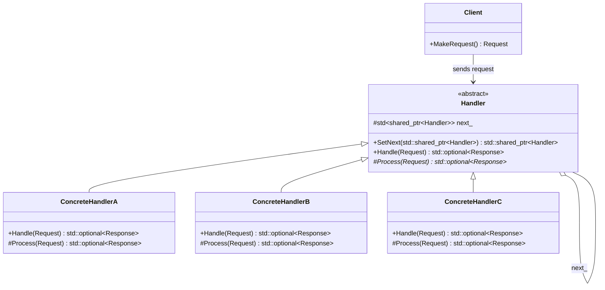

# Chain of Responsibility（责任链模式）

## 意图
使多个对象都有机会处理请求，从而避免请求的发送者与接收者之间的耦合。将这些对象连成一条链，并沿着这条链传递请求，直到有一个对象处理它为止。

## 问题
假设你正在设计一个费用审批系统：团队领导可以审批 1000 元以下的报销，部门经理可以审批 10000 元以下的报销，副总裁可以审批更大的金额。如果在请求发送端用大量 `if-else` 来判断由谁审批，代码会变得僵硬且难以扩展——每增加一个审批层级都需要修改请求发送端的代码。此外，发送者不需要知道到底是谁最终处理了请求，这种紧耦合是不必要的。

## 解决方案
责任链模式的核心思想是：为多个潜在的处理者建立一条单向链表，每个处理者持有对下一个处理者的引用。当请求到达时，当前处理者判断自己能否处理：能则处理并返回，不能则转发给链中的下一个处理者。请求沿着链逐级传递，直到被某个节点处理，或者到达链尾而无人处理。这样，请求的发送者只需要将请求交给链头即可，完全不需要了解链的结构。

## UML 类图

## 适用场景
- 多个对象都可能处理某个请求，但具体由谁处理在运行时才决定
- 你想在不明确指定接收者的情况下向多个对象中的某一个提交请求
- 可以动态地指定处理者集合及其顺序（例如中间件管道、事件冒泡机制）

## 优缺点

**优点**：
- 解耦了请求的发送者和接收者，发送者无需知道链的结构
- 增强了给对象指派职责的灵活性，可以动态改变链内的成员或调整它们的顺序

**缺点**：
- 请求不一定会被处理——如果到达链尾都没有处理者，请求就静默丢失了
- 链过长时性能会下降，因为请求可能需要遍历整个链

## C++17 实现要点
- **`std::optional`**：`Handle` 和 `Process` 方法返回 `std::optional<Response>`，优雅地表达"处理了"或"未处理"两种状态，比返回 `bool` 加输出参数更清晰
- **`std::variant`**：用 `std::variant` 定义请求体，利用类型安全的联合体来表达不同类型的请求负载
- **`if constexpr`**：在处理不同类型请求时利用编译期分支消除不必要的运行时开销
- **结构化绑定**：在解析处理结果时使用结构化绑定，代码更简洁
- **`std::string_view`**：避免不必要的字符串拷贝，提高效率
- **`[[nodiscard]]`**：标记关键返回值函数，防止调用者忽略处理结果
- **内联变量（`inline`）**：在头文件中定义常量时避免多重定义问题

与传统 C++ 实现相比，C++17 版本利用类型系统（`optional`、`variant`）替代了裸指针和错误码，代码更安全、更表达意图。

## 相关模式
- **命令模式（Command）**：责任链中的请求可以封装为命令对象，两者可以结合使用
- **装饰器模式（Decorator）**：结构上类似（都是链式传递），但意图不同——装饰器关注增强功能，责任链关注找人处理
- **组合模式（Composite）**：责任链可以沿着组合模式的树结构传递，形成树状责任链

## 代码示例
指向 src/behavioral/chain-of-responsibility/main.cpp
