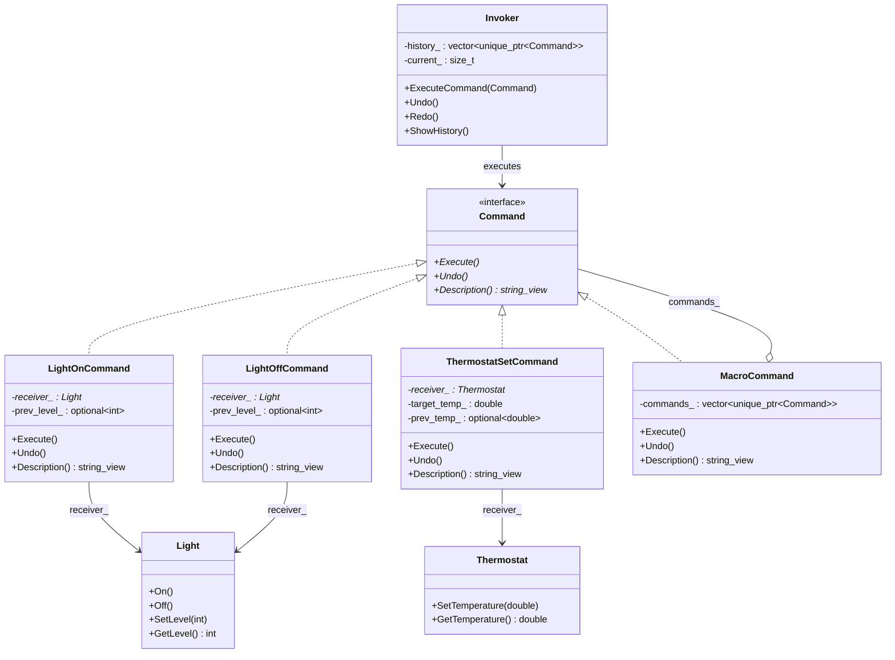

# Command（命令模式）

## 意图
将请求封装为对象，从而让你可以用不同的请求参数化客户端，将请求放入队列或记录日志，以及支持可撤销的操作。

## 问题
假设你正在开发一个智能家居遥控器应用：每个按钮可以控制不同的设备（灯光、空调、音响等），而且还需要支持撤销操作和宏命令（一键触发多个设备）。如果在按钮的点击处理中直接调用设备方法，那么按钮与具体设备操作就会紧密耦合——每增加一种新设备或新操作，都要修改按钮的代码。更棘手的是，要实现"撤销"功能，你必须知道上一步做了什么、如何反向操作，这些逻辑如果散落在 UI 代码中会变得难以维护。

## 解决方案
命令模式的核心思想是：将"请求"本身抽象为一个对象。每个命令对象封装了执行某个操作所需的全部信息——接收者是谁、调用什么方法、传入什么参数。调用者（Invoker）只持有命令对象的接口，完全不知道具体执行细节。这样，你可以将命令放入队列、记录到日志、组合成宏命令，还可以在命令对象中保存状态以便撤销。

## UML 类图

## 适用场景
- 需要将请求发送者与接收者解耦，让发送者不关心具体由谁执行、如何执行
- 需要支持撤销（Undo）和重做（Redo）操作，命令对象可以在执行前保存接收者的状态
- 需要将操作组合成宏命令，或者将操作放入队列、记录到日志中延迟执行

## 优缺点

**优点**：
- 解耦了调用者与接收者，调用者只需要调用命令的 Execute()，无需了解具体实现
- 天然支持撤销/重做、命令队列、事务日志等高级功能
- 可以轻松地将简单命令组合成复合命令（宏命令）

**缺点**：
- 每个具体操作都需要一个命令类，可能导致类的数量急剧膨胀
- 命令对象增加了间接层，对于简单的操作来说可能过度设计

## C++17 实现要点
- **`std::unique_ptr`**：命令对象通过 `std::unique_ptr` 管理所有权，调用者通过 `std::move` 转移所有权给调用栈，避免内存泄漏
- **`std::optional`**：用于保存执行命令前接收者的状态（如灯光亮度、空调温度），撤销时恢复。`std::nullopt` 表示该命令不可撤销或无需保存状态
- **`std::string_view`**：命令的描述信息使用 `std::string_view`，避免不必要的字符串拷贝
- **`[[nodiscard]]`**：标记关键返回值函数，防止调用者忽略结果
- **`inline` 变量**：在文件作用域定义常量时使用 `inline constexpr`，避免多重定义问题
- **结构化绑定**：在展示命令历史等场景中使用结构化绑定，代码更简洁
- **Range-based for with initializer**（C++20 之前可用初始化列表替代）：遍历命令历史时保持代码清晰

与传统 C++ 实现相比，C++17 版本大量使用智能指针替代裸指针，用 `std::optional` 替代哨兵值或布尔标志，代码更安全、更表达意图。

## 相关模式
- **备忘录模式（Memento）**：命令模式的 Undo 功能可以结合备忘录模式来保存和恢复接收者的完整状态
- **策略模式（Strategy）**：两者都封装了行为，但命令模式强调"请求的封装与排队"，策略模式强调"算法的可替换性"
- **组合模式（Composite）**：宏命令（MacroCommand）本质上就是组合模式——将多个命令组合成一个复合命令
- **责任链模式（Chain of Responsibility）**：命令对象可以作为责任链中传递的请求

## 代码示例
指向 src/behavioral/command/main.cpp
