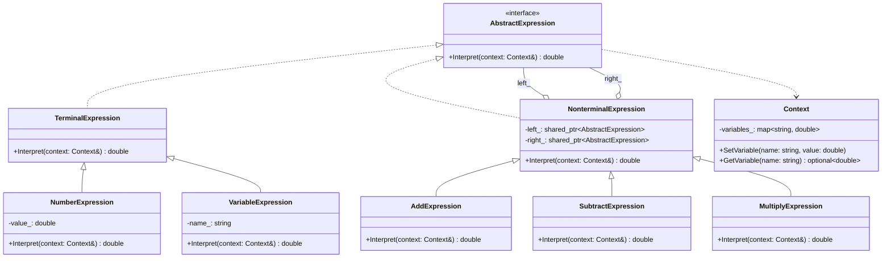

# Interpreter（解释器模式）

## 意图
给定一门语言，定义其文法表示，并定义一个解释器，使用该表示来解释语言中的句子。

## 问题
当需要解析和执行一种简单的领域特定语言（DSL）时，例如数学表达式、布尔表达式、SQL 子集或配置规则，如果将语法硬编码到业务逻辑中，代码会变得臃肿且难以扩展。每增加一条语法规则就需要修改大量代码，违反开闭原则。

## 解决方案
将每条语法规则封装为一个类，规则的组合构成一棵抽象语法树（AST）。客户端构建语法树后，调用顶层节点的 `Interpret()` 方法即可递归解释整棵树。终端节点（操作数）直接返回值，非终端节点（运算符）递归解释子节点后计算结果。

## UML 类图

## 适用场景
- 需要解析和求值简单的数学或布尔表达式
- 实现领域特定语言（DSL），如规则引擎、查询语言
- 编译器或解释器中的语法分析阶段
- 配置文件解析，将配置规则表示为可解释的语法树

## 优缺点

**优点**：
- 易于扩展语法：新增语法规则只需添加新的表达式类，符合开闭原则
- 文法易于实现：每条规则对应一个类，结构清晰
- 可以方便地修改和扩展语言的语法规则

**缺点**：
- 复杂文法难以维护：规则数量膨胀时类的数量急剧增加
- 执行效率较低：解释器通常采用递归调用，对于复杂语法树性能不理想
- 不适合复杂语言：对于工业级语言，应使用语法分析器生成工具（如 ANTLR、Yacc）

## C++17 实现要点
- **std::optional**：用于变量查找返回值，优雅处理变量不存在的情况
- **std::string_view**：解析阶段零拷贝引用源字符串，避免不必要的内存分配
- **std::shared_ptr**：管理语法树节点的生命周期，自动释放整棵树
- **结构化绑定（Structured Bindings）**：简化 map 查找和 pair/tuple 解包
- **if constexpr**：编译期分派，根据表达式类型选择不同的解释策略
- **inline 变量**：在头文件中定义全局常量（如运算符优先级表），避免 ODR 问题
- **std::variant**：将表达式结果类型安全地封装为数值或错误信息
- **折叠表达式（Fold Expressions）**：在参数包展开场景下简化多操作数运算

与传统 C++ 实现相比，C++17 版本类型安全性更强（用 optional/variant 替代裸指针和错误码），内存管理更安全（智能指针替代手动 new/delete），且代码更简洁（结构化绑定和 if constexpr 减少样板代码）。

## 相关模式
- **组合模式（Composite）**：解释器模式的语法树本质上是组合模式的实例，非终端表达式组合子表达式
- **访问者模式（Visitor）**：可以在不修改表达式类的情况下，通过访问者添加新的操作（如打印、优化）
- **享元模式（Flyweight）**：终端表达式中的共享符号可以使用享元模式节省内存

## 代码示例
指向 [src/behavioral/interpreter/main.cpp](../../src/behavioral/interpreter/main.cpp)
