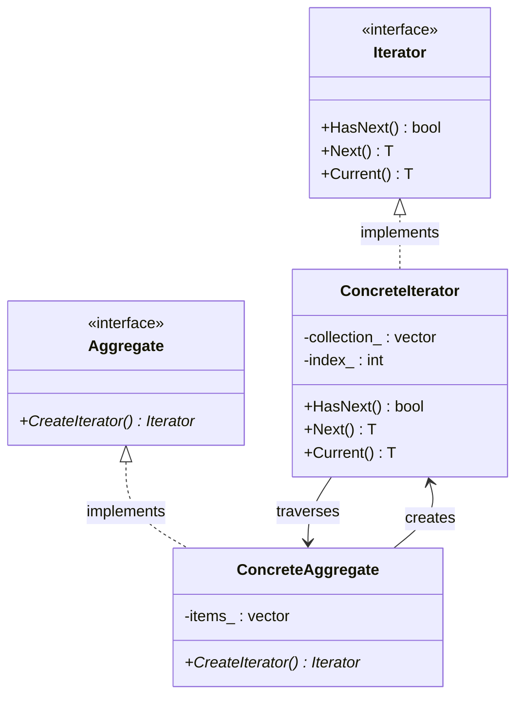

# Iterator（迭代器模式）

## 意图
提供一种方法顺序访问一个聚合对象中的各个元素，而不暴露该对象的内部表示。

## 问题
当需要遍历一个复杂的数据结构（如树、图、哈希表）时，客户端代码往往需要了解该数据结构的内部实现细节才能进行遍历。这导致了客户端与数据结构的紧耦合，一旦数据结构发生变化，所有遍历代码都需要修改。此外，不同的遍历方式（前序、中序、后序、广度优先等）会使得聚合类的接口变得臃肿不堪。

## 解决方案
将遍历行为从聚合对象中抽取出来，封装到一个独立的迭代器对象中。迭代器对象实现了统一的遍历接口（如 `HasNext()`、`Next()`），客户端只需通过迭代器接口即可逐个访问元素，完全无需关心底层数据结构的具体形态。聚合对象负责创建对应的迭代器实例，从而将遍历逻辑与数据存储解耦。

## UML 类图

## 适用场景
- 需要遍历一个复杂集合（树、图、哈希表）而又不想暴露其内部结构时
- 需要为同一个聚合对象提供多种遍历方式（正序、倒序、过滤遍历等）时
- 需要为不同的聚合结构提供统一的遍历接口时

## 优缺点

**优点**：
- 单一职责：将遍历逻辑从聚合类中分离，使两者各自独立演化
- 开闭原则：可以引入新的迭代器而无需修改聚合类或客户端代码
- 支持多种遍历策略，同一聚合对象可以同时存在多个活跃的迭代器

**缺点**：
- 对于简单的集合（如数组），引入迭代器可能增加不必要的复杂度
- 迭代器在遍历过程中如果聚合对象被修改，可能产生未定义行为（需要额外的并发保护或失效检测机制）

## C++17 实现要点
- **`std::optional`**：用于表示迭代器在越界时返回"无值"状态，替代传统的哨兵值或异常，表达意图更加明确
- **`if constexpr`**：在模板化的迭代器中根据元素类型在编译期选择不同的行为（如是否需要拷贝保护），实现零开销抽象
- **`inline` 变量**：用于定义迭代器的全局常量（如默认步长），避免多重定义问题
- **`std::shared_mutex`**：为聚合容器提供读写锁保护，使迭代器在多线程环境下安全遍历
- 与传统 C++11/14 实现相比，`std::optional` 消除了对裸指针或哨兵值的依赖，`if constexpr` 替代了 SFINAE 的冗长写法，代码可读性和安全性显著提升

## 相关模式
- **组合模式（Composite）**：迭代器常用于遍历组合模式中的树形结构，组合模式提供递归结构，迭代器提供线性访问
- **工厂方法（Factory Method）**：聚合对象通过工厂方法 `CreateIterator()` 创建具体的迭代器实例，客户端无需知道迭代器的具体类型
- **备忘录模式（Memento）**：迭代器可以与备忘录结合，保存和恢复遍历位置

## 代码示例
参见 [src/behavioral/iterator/main.cpp](../../src/behavioral/iterator/main.cpp)
