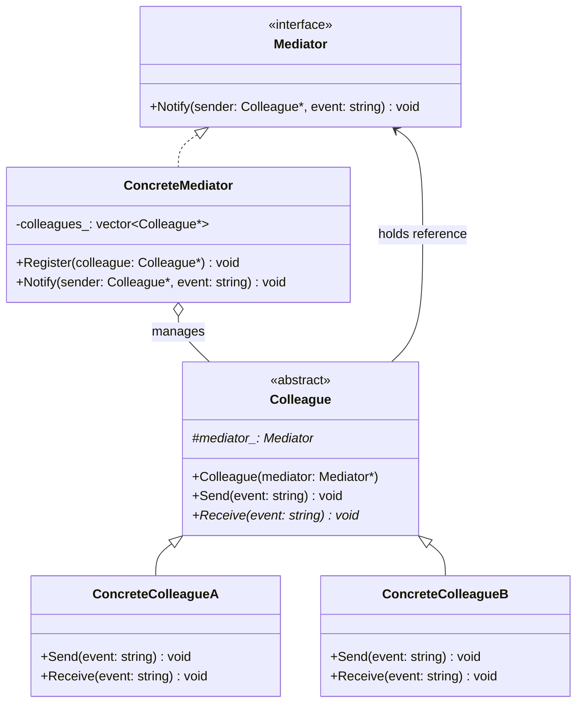

# Mediator（中介者模式）

## 意图
用一个中介对象封装一系列对象之间的交互，使各对象不需要显式地相互引用，从而使其耦合松散，且可以独立地改变它们之间的交互。

## 问题
当系统中多个组件（或同事类）之间存在复杂的多对多交互关系时，每个组件都需要知道其他所有组件的存在，导致对象之间紧密耦合。例如一个聊天室场景：多个用户相互发消息，如果每个用户都直接持有其他所有用户的引用，那么新增或移除用户时需要修改大量代码，系统变得难以维护和扩展。

## 解决方案
引入一个中介者对象，将网状的多对多交互转变为星形的一对多交互。各同事对象不再直接通信，而是通过中介者转发消息。中介者集中控制逻辑，各同事类只需持有中介者的引用，与中介者交互即可。这样每个同事类只依赖中介者，而不依赖其他同事类。

## UML 类图

## 适用场景
- 多个对象之间存在复杂的交互关系，且这些交互需要集中管理
- 一个对象引用了大量其他对象并与之通信，导致难以复用
- 希望在不修改各同事类的前提下改变它们之间的交互逻辑，例如聊天室、GUI 组件间的联动、航空管制塔台等

## 优缺点

**优点**：
- 松耦合：同事类之间不再直接依赖，只需与中介者交互，降低了系统的复杂度
- 集中控制：交互逻辑集中在中介者中，便于理解和维护
- 符合迪米特法则（最少知识原则），每个同事类只需知道中介者

**缺点**：
- 中介者可能变得过于庞大，承担过多职责，退化为"上帝对象"
- 中介者集中了所有交互逻辑，如果逻辑复杂，中介者类会变得难以维护

## C++17 实现要点
- 使用 `std::variant` 定义类型安全的事件消息，替代传统的字符串或枚举分发
- 使用 `std::optional` 表示可选的返回结果，避免空指针
- 使用 `if constexpr` 在编译期对不同事件类型进行分发
- 使用结构化绑定（structured bindings）简化事件处理
- 使用 `inline` 变量定义全局常量
- 使用 `std::shared_ptr` / `std::weak_ptr` 管理中介者和同事的生命周期
- 与传统实现对比：传统实现使用枚举或字符串标识事件，运行时需 dynamic_cast 或 switch-case；C++17 的 variant + visit 提供编译期类型安全

## 相关模式
- **观察者模式**：中介者可以看作对观察者的集中化，观察者模式中对象之间可以多对多通知，而中介者模式将交互集中到一个中介者
- **外观模式**：外观模式提供简化的接口，不添加新功能；中介者则封装对象之间的协作逻辑
- **命令模式**：可以将同事发出的请求封装为命令对象，交给中介者排队或延迟处理

## 代码示例
指向 src/behavioral/mediator/main.cpp
