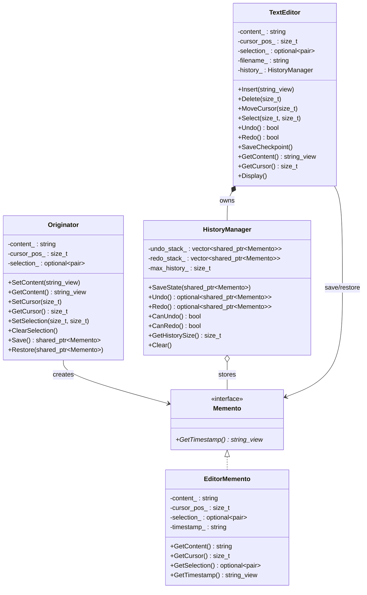

# Memento（备忘录模式）

## 意图
在不暴露对象内部实现细节的前提下，捕获并保存对象的内部状态，以便在需要时能将对象恢复到先前的某个状态。

## 问题
假设你正在开发一个文本编辑器，需要支持撤销（Undo）和重做（Redo）功能。编辑器的内部状态非常复杂——包含文档文本、光标位置、选区范围、滚动偏移、字体设置等多个字段。要实现撤销，最粗暴的办法是在每一步操作前把整个编辑器对象复制一份。但这意味着你必须把编辑器的所有内部字段暴露给外部管理代码，破坏了封装性；而且让外部代码了解编辑器的内部结构会导致高度耦合，一旦编辑器的内部实现发生变化，所有管理快照的代码都得跟着改。

## 解决方案
备忘录模式引入了一个"备忘录"（Memento）对象，由原发器（Originator，即编辑器自身）负责创建。备忘录是原发器内部状态的一个快照，但它的接口对看管者（Caretaker）是不透明的——看管者只知道"这是一个快照"，而不知道里面具体存了什么。原发器提供 `Save()` 方法生成备忘录，以及 `Restore()` 方法从备忘录恢复状态。看管者（例如历史管理器）只负责存储和按顺序提供备忘录，不干涉其内容。这样既保护了封装性，又实现了灵活的状态回溯。

## UML 类图

## 适用场景
- 需要实现撤销/重做功能，且对象的内部状态复杂（如文本编辑器、图形编辑器、游戏存档）
- 需要在不破坏封装性的前提下保存和恢复对象的内部快照
- 需要实现"检查点"或"事务回滚"机制，在出错时将对象回退到某个安全状态

## 优缺点

**优点**：
- 保持了封装边界：备忘录的内部结构对看管者完全不透明，原发器的实现细节不会泄露
- 简化了原发器代码：原发器不再需要维护多个历史版本的内部状态，将其委托给看管者管理
- 支持多级撤销/重做：通过维护备忘录栈可以轻松实现任意深度的历史回溯

**缺点**：
- 内存开销大：每次保存状态都要创建一个备忘录对象，如果状态很大或保存频繁，会消耗大量内存
- 创建和恢复备忘录可能很昂贵：如果原发器的状态包含大量数据，序列化和反序列化的开销不可忽视

## C++17 实现要点
- **`std::shared_ptr`**：备忘录对象使用 `std::shared_ptr` 管理生命周期，因为同一份快照可能同时存在于撤销栈和重做栈中（撤销后再执行新操作时，重做栈中的备忘录仍需保留）
- **`std::optional`**：用于表示选区可能不存在的状态（未选中时为 `std::nullopt`），也用于 `HistoryManager::Undo()` / `Redo()` 返回可能失败的结果，比返回空指针更表达意图
- **`std::variant`**：用于表达编辑器操作的不同类型（插入文本、删除、移动光标），替代传统的继承层次
- **`std::string_view`**：备忘录的只读访问接口使用 `std::string_view`，避免不必要的字符串拷贝
- **结构化绑定**：在获取选区范围、遍历历史记录等场景中使用 `auto [begin, end]` 语法，代码更简洁
- **`[[nodiscard]]`**：标记关键返回值函数（如 `Save()`、`Undo()`），防止调用者忽略可能失败的操作
- **`inline constexpr`**：在类内定义常量（如最大历史深度），避免 ODR 违规

与传统 C++ 实现相比，C++17 版本用 `std::optional` 替代了哨兵值和布尔标志，用 `std::variant` 替代了带标签的联合体或类型枚举，用 `std::shared_ptr` 替代了手动引用计数，代码更安全、更表达意图。

## 相关模式
- **命令模式（Command）**：命令模式中的每个命令可以持有一个备忘录，用于在执行前保存接收者的状态以支持撤销。备忘录模式专注于"状态快照的保存与恢复"，命令模式专注于"请求的封装与排队"
- **迭代器模式（Iterator）**：看管者可以使用迭代器来遍历历史记录，但备忘录本身不提供遍历能力
- **原型模式（Prototype）**：备忘录的创建本质上是原发器状态的"深拷贝"，与原型模式的克隆思想相似，但备忘录模式更强调不透明性和状态恢复

## 代码示例
指向 src/behavioral/memento/main.cpp
