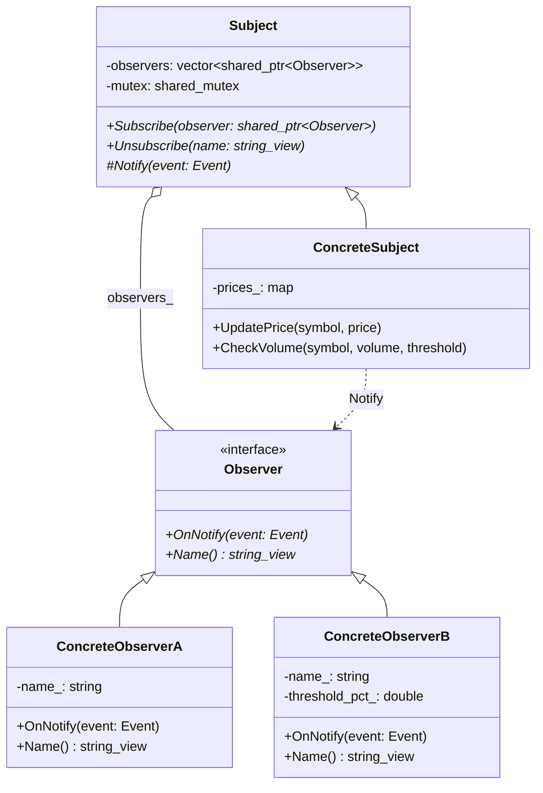

# Observer（观察者模式）

## 意图
定义对象之间的一对多依赖关系，当一个对象（Subject）状态发生改变时，所有依赖于它的对象（Observer）都会自动收到通知并更新。

## 问题
在软件系统中，一个对象的状态变化常常需要通知其他多个对象，但又不希望它们之间产生紧密耦合。例如，一个股票交易所的股价变动需要同时通知交易面板、风控系统、日志记录器等多个下游模块。如果直接在股价对象中硬编码调用这些模块，会导致：模块间高度耦合、新增观察者需要修改主题代码、难以独立复用和测试各个模块。

## 解决方案
观察者模式的核心思想是将"通知"这个行为抽象出来。主题（Subject）维护一个观察者列表，提供注册（Subscribe）和注销（Unsubscribe）接口；当主题状态变化时，遍历列表调用每个观察者的更新方法。观察者只需实现统一的更新接口即可。这样主题和观察者之间仅通过抽象接口交互，实现了松耦合——新增观察者无需修改主题代码，观察者也可以随时动态加入或退出。

## UML 类图

## 适用场景
- GUI 框架中，模型数据变化时需要自动刷新多个视图组件
- 消息推送系统中，一个消息源需要同时通知多个订阅者（如邮件、短信、App 推送）
- 股票/金融系统中，行情变动需要通知交易面板、风控引擎、日志服务等多个下游系统
- 事件驱动架构中，事件总线（EventBus）将事件分发给已注册的监听器
- 发布-订阅（Pub/Sub）系统的简化实现

## 优缺点

**优点**：
- 松耦合：主题和观察者之间仅依赖抽象接口，可以独立扩展和复用
- 支持广播通信：主题无需关心观察者的具体类型和数量，一对多通知自动完成
- 动态关系：观察者可以在运行时随时注册或注销，灵活度高

**缺点**：
- 通知顺序不可控：观察者的调用顺序通常无法保证，若存在顺序依赖可能引发问题
- 内存泄漏风险：如果观察者未正确注销，主题持有的引用可能导致悬垂指针或阻止对象析构（使用 `weak_ptr` 可缓解）
- 过度使用导致调试困难：事件驱动的隐式调用链可能使程序流程难以追踪

## C++17 实现要点
- **std::variant**：用 `std::variant<PriceChanged, VolumeAlert>` 替代传统的继承层次来表示不同类型的事件，实现类型安全的联合体，避免 `dynamic_cast`
- **std::visit + Overloaded 惯用法**：利用 C++17 的类模板参数推导（CTAD）实现 Overloaded 辅助结构体，对 variant 进行类型安全的访问分发，替代传统的虚函数或多级 `if-else`
- **std::optional**：在 `UpdatePrice` 中使用 `std::optional<double>` 表示"旧价格可能不存在（首次报价）"的语义，比哨兵值（如 -1）更清晰
- **std::shared_mutex / std::shared_lock / std::unique_lock**：读操作（Notify 遍历观察者）使用共享锁，写操作（Subscribe/Unsubscribe）使用独占锁，实现线程安全的读写分离
- **std::string_view**：观察者名称等只读字符串参数使用 `string_view` 避免不必要的拷贝
- **inline 变量**：使用 `inline constexpr` 定义模块级常量
- **结构化绑定**：在需要同时获取多个返回值的场景中使用
- 与传统实现对比：传统 C++ 观察者模式通常使用纯虚函数 + `std::vector<Observer*>` + 手动内存管理；C++17 版本用 variant 替代事件类继承层次，用 shared_mutex 保证线程安全，用智能指针管理生命周期，代码更安全、更简洁

## 相关模式
- **中介者模式（Mediator）**：两者都用于解耦对象间通信，但观察者是"一对多"广播，中介者是"多对多"集中调度
- **发布-订阅模式（Pub/Sub）**：观察者模式是 Pub/Sub 的简化形式；Pub/Sub 通常引入独立的消息代理（Broker），发布者和订阅者完全不知道彼此的存在
- **事件总线模式（EventBus）**：是观察者模式的全局化扩展，通过一个全局事件通道分发事件，常用于 GUI 框架和微服务架构
- **职责链模式（Chain of Responsibility）**：也涉及消息的传递，但职责链中消息沿链传递直到被处理，而观察者模式中消息同时通知所有观察者

## 代码示例
见 [src/behavioral/observer/main.cpp](../../src/behavioral/observer/main.cpp)
