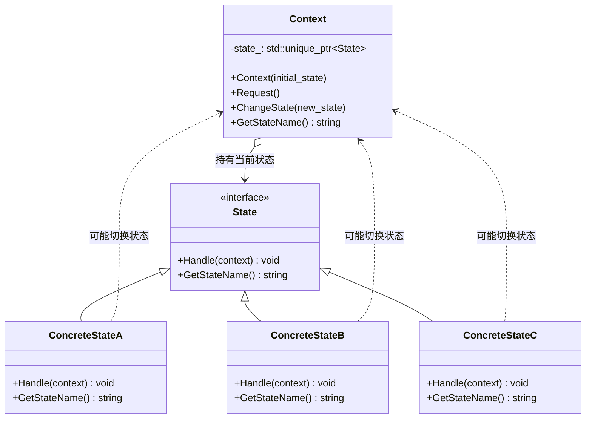

# State（状态模式）

## 意图
允许对象在内部状态改变时改变其行为，看起来好像改变了其所属的类。

## 问题
当一个对象的行为取决于其状态，并且它必须在运行时根据状态改变其行为时，代码中会出现大量的条件语句（如 if-else 或 switch-case）。这些条件语句散布在各个方法中，使得代码难以维护和扩展。每增加一个新的状态，都需要修改多个地方的代码，违反了开闭原则。

例如，考虑一个文档处理系统，文档有草稿、审核中、已发布等状态，每个状态下对编辑、提交审核、发布等操作的行为都不同。如果用条件语句实现，状态转换逻辑会分散在整个类中，难以管理。

## 解决方案
状态模式的核心思想是将每个状态封装为一个独立的类，并将状态相关的行为委托给当前状态对象。具体做法是：

1. 定义一个状态接口（抽象类），声明所有状态相关的行为方法
2. 为每个具体状态创建一个类，实现状态接口中定义的行为
3. 在上下文类（Context）中持有一个指向当前状态对象的指针，并将所有状态相关的行为委托给当前状态
4. 状态转换由状态对象自身负责，当满足条件时，状态对象可以切换上下文的当前状态

这样，每个状态的行为被封装在独立的类中，新增状态只需添加新的状态类，无需修改已有代码。

## UML 类图

## 适用场景
- 当对象的行为取决于其状态，并且必须在运行时根据状态改变行为时
- 当代码中有大量与对象状态相关的条件语句时，可以用状态模式将每个条件分支放入独立的状态类中
- 当某个类有多个状态，且状态之间存在明确的转换规则时，如工作流引擎、订单处理系统、游戏中的角色状态等

## 优缺点

**优点**：
- 单一职责原则：将与特定状态相关的代码组织到独立的类中，便于理解和维护
- 开闭原则：无需修改已有状态类和上下文代码就能引入新状态
- 消除庞大的条件分支：用多态替代了复杂的 if-else 或 switch-case 结构
- 状态转换显式化：状态之间的转换规则被集中在各个状态类中，清晰可见

**缺点**：
- 可能导致类的数量膨胀：每个状态都需要一个独立的类，当状态很多时会增加系统复杂度
- 状态逻辑分散：状态转换逻辑分散在各个状态类中，不易于整体把握系统的状态转换图
- 增加了间接层：引入了额外的抽象层，对于简单的状态逻辑可能是过度设计

## C++17 实现要点
- 使用 std::variant 替代传统的继承体系来表示状态，实现类型安全的状态存储和访问
- 使用 std::optional 表示可能失败的状态转换，避免使用空指针
- 使用 std::shared_mutex 实现线程安全的状态访问和切换
- 使用 if constexpr 进行编译期状态类型检查
- 使用结构化绑定简化状态信息的获取
- 使用 inline 变量定义全局状态名称常量
- 与传统实现相比，std::variant 方案避免了虚函数调用开销，且在编译期就能检查状态类型的完整性

## 相关模式
- 策略模式：状态模式和策略模式结构类似，但意图不同。策略模式是在运行时选择算法，由客户端主动选择；状态模式是对象根据内部状态自动切换行为，状态转换对客户端透明。
- 单例模式：具体状态对象通常是无状态的，可以实现为单例以节省内存。
- 观察者模式：状态转换时可以通知观察者，两种模式可以结合使用。

## 代码示例
详见 [src/behavioral/state/main.cpp](../../src/behavioral/state/main.cpp)
