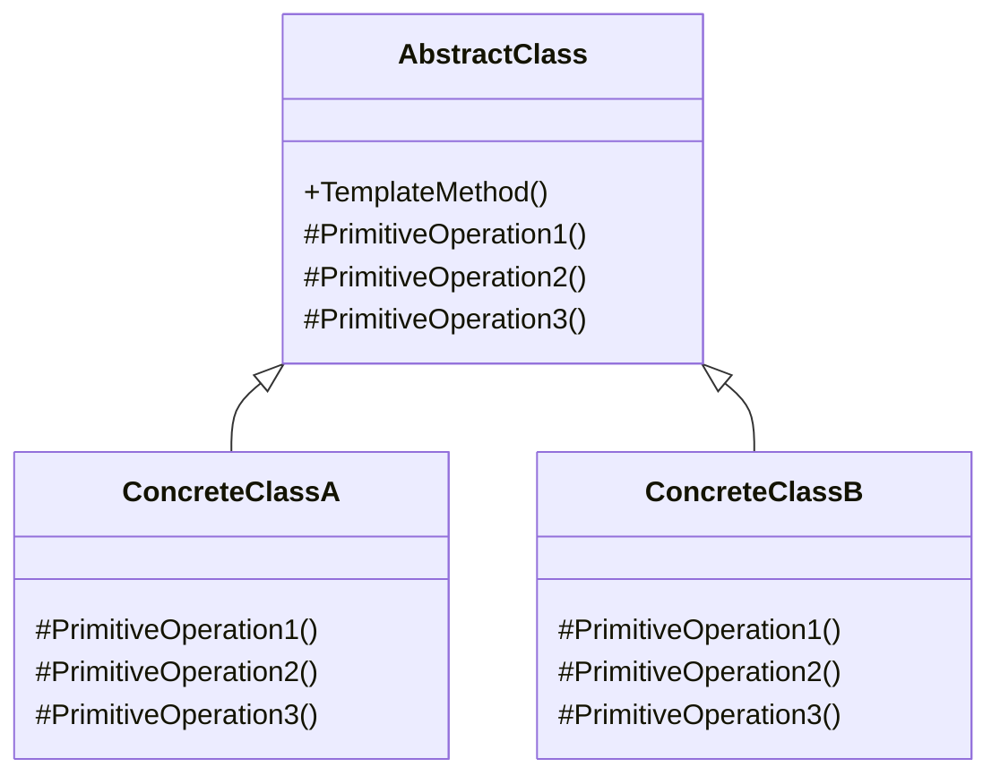

# Template Method（模板方法模式）

## 意图
定义一个操作中算法的骨架，而将一些步骤延迟到子类中。模板方法使得子类可以不改变一个算法的结构即可重定义该算法的某些特定步骤。

## 问题
在软件开发中，我们经常会遇到这样的情况：某个操作的流程是固定的，但某些具体步骤的实现会因场景不同而变化。例如：
- 数据导出功能：导出流程（打开文件、写入头部、写入数据、关闭文件）是固定的，但不同格式（CSV、JSON、XML）的写入方式不同
- 游戏AI：AI行为的执行顺序是固定的（评估、决策、执行），但不同角色的具体行为不同
- 数据库访问：查询流程（连接、执行、处理结果、关闭连接）是固定的，但不同数据库的连接方式不同

如果直接在每个子类中重复实现整个流程，会导致代码冗余且难以维护。

## 解决方案
模板方法模式的核心思想是：
1. 在基类中定义一个模板方法（Template Method），该方法包含算法的骨架
2. 将算法中可变的部分声明为虚函数（或纯虚函数），由子类提供具体实现
3. 子类通过重写这些虚函数来定制算法的特定步骤，而不改变算法的整体结构

这种方式实现了"好莱坞原则"：别调用我们，我们会调用你（Don't call us, we'll call you）。

## UML 类图

## 适用场景
- 当多个类有相同的算法骨架，但某些步骤的实现不同时
- 当需要控制子类的扩展点，只允许在特定位置进行扩展时
- 当希望避免代码重复，将公共的算法步骤提取到基类时

## 优缺点

**优点**：
- 代码复用：将算法的公共部分提取到基类，避免代码重复
- 扩展性好：子类可以通过重写特定步骤来扩展算法，而不影响整体结构
- 符合开闭原则：增加新的具体实现不需要修改现有代码

**缺点**：
- 类数量增加：每个不同的实现都需要一个新的子类
- 继承限制：由于使用继承，无法在运行时改变算法的步骤
- 调试困难：算法的控制流程分散在多个类中，调试时可能需要跟踪多个类

## C++17 实现要点
- 使用 `std::optional` 表示可选步骤，避免空指针检查
- 使用 `std::variant` 实现类型安全的多态，避免传统虚函数的开销
- 使用 `if constexpr` 在编译时决定是否执行某些步骤
- 使用结构化绑定简化数据访问
- 使用 `std::string_view` 避免不必要的字符串拷贝
- 使用内联变量（inline variables）定义类级别的常量

与传统实现相比，C++17 版本：
- 更安全：使用 `std::optional` 和 `std::variant` 避免空指针和类型转换错误
- 更高效：使用 `if constexpr` 在编译时消除不必要的分支
- 更现代：使用结构化绑定和 `string_view` 等特性简化代码

## 相关模式
- **工厂方法模式**：模板方法经常调用工厂方法来创建对象。工厂方法是模板方法的一个特例。
- **策略模式**：策略模式通过组合改变算法，而模板方法通过继承改变算法。
- **建造者模式**：建造者模式关注对象的构建过程，而模板方法关注算法的步骤。

## 代码示例
指向 src/behavioral/template-method/main.cpp
