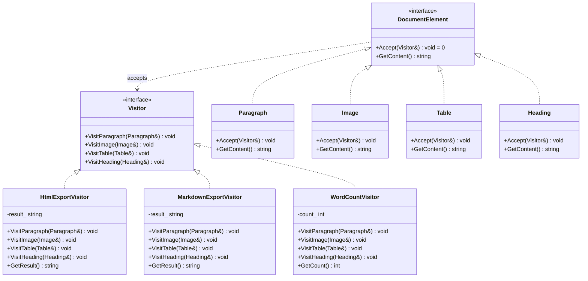

# Visitor（访问者模式）

## 意图
将算法与其所操作的对象结构分离，使得可以在不修改对象结构的前提下为该结构中的元素添加新的操作。

## 问题
假设你正在开发一个文档编辑器，文档由多种元素组成：段落（Paragraph）、图片（Image）、表格（Table）、标题（Heading）。你需要对这些元素执行不同的操作——导出为 HTML、导出为 Markdown、统计字数、拼写检查等。如果把每种操作都塞进元素类本身，那么每新增一种操作就必须修改所有元素类，这违反了开闭原则。更糟糕的是，这些操作之间毫无关联，放在同一个类里会导致类的职责膨胀、难以维护。

## 解决方案
访问者模式的核心思想是：将"做什么"（操作）和"对谁做"（元素）分离。具体做法是为每种操作定义一个访问者（Visitor）类，该类为对象结构中的每种元素类型提供一个专门的 visit 方法。元素类只需提供一个 Accept(Visitor&) 方法，将自身（this）回传给访问者，从而触发双重分派（double dispatch）。这样，新增操作只需新增一个访问者类，无需修改任何已有元素类；反之，新增元素类型也只需在所有访问者中添加对应的 visit 重载（编译器会强制提醒，因为纯虚函数未实现）。

## UML 类图

## 适用场景
- 对象结构稳定但需要频繁添加新操作，例如编译器的抽象语法树（AST）需要类型检查、代码生成、优化等多种遍历操作
- 对象结构中的类种类很多且彼此不相关，但需要对它们执行依赖具体类型的操作，例如文档元素的导出与统计
- 需要对对象结构中的元素执行多种不相关的操作，且不希望这些操作污染元素类本身，例如图形编辑器中对图形元素的渲染、序列化、碰撞检测

## 优缺点

**优点**：
- 符合单一职责原则：每个访问者封装了一种操作，元素类只负责自身数据，两者互不干扰
- 符合开闭原则：新增操作只需新增访问者类，无需修改已有元素类和访问者
- 可以累积状态：访问者在遍历过程中可以积累中间结果，方便实现复杂的聚合操作

**缺点**：
- 新增元素类型困难：每新增一种元素类型，就必须修改所有已有访问者接口（添加新的 visit 方法），违反开闭原则的另一面
- 破坏封装：访问者需要访问元素的内部状态，元素往往不得不暴露其私有数据，削弱了封装性
- 双重分派的复杂性：C++ 不原生支持双重分派，需要手动通过 Accept/Visit 方法链实现，代码结构较为繁琐

## C++17 实现要点
- 使用 `std::variant` 表示文档元素的类型安全联合体，配合 `std::visit` 和重载 lambda 实现替代传统双重分派的现代写法
- 使用 `if constexpr` 在编译期根据 variant 中的具体类型分派不同的行为，避免运行时 `dynamic_cast`
- 使用折叠表达式（fold expression）对变参模板展开的重载 lambda 进行组合，优雅地实现 overloaded 模式
- 使用 `std::optional` 表示可能不存在的查找结果（如按名称查找文档元素）
- 使用结构化绑定（structured bindings）简化对容器元素的解构访问
- 使用 `inline` 变量定义全局常量，避免多重定义问题
- 与传统实现对比：传统实现依赖虚函数 + 基类指针的双重分派（Accept/Visit），本实现同时保留了传统虚函数版本（完整的 DocumentElement 继承体系）和现代 `std::variant` + `std::visit` 版本，让读者直观对比两种范式

## 相关模式
- **Interpreter（解释器模式）**：解释器模式中的语法节点通常使用访问者模式来执行不同的操作（求值、打印、优化等），二者经常配合使用
- **Composite（组合模式）**：访问者模式通常作用于组合模式所构建的树形结构上，组合模式负责结构，访问者负责操作
- **Strategy（策略模式）**：策略模式将算法封装在独立的策略类中，与访问者类似都遵循开闭原则；区别在于策略模式针对单一操作的多种实现，访问者模式针对多种操作作用于多种类型

## 代码示例
详见 [src/behavioral/visitor/main.cpp](../../src/behavioral/visitor/main.cpp)
