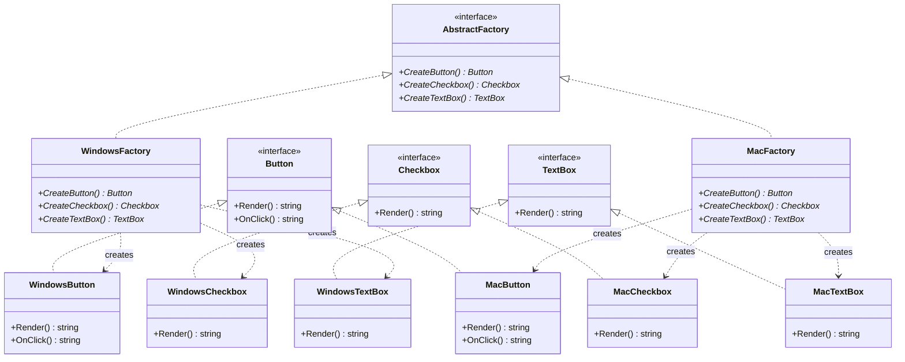

# Abstract Factory（抽象工厂模式）

## 意图
提供一个接口，用于创建一系列相关或相互依赖的对象，而无需指定它们的具体类。

## 问题
假设你正在开发一个跨平台的 UI 工具包，需要同时支持 Windows 和 macOS 两套主题风格。每种风格都包含按钮（Button）、复选框（Checkbox）、文本框（TextBox）等控件。如果在业务代码中直接 `new WindowsButton()`、`new MacCheckbox()`，就会把具体产品类硬编码到整个系统中。当你需要新增 Linux 主题时，就必须在所有创建点逐一修改，违反了开闭原则。更严重的是，如果某处错误地混用了 Windows 按钮和 macOS 复选框，会导致视觉风格不一致甚至运行时错误。

## 解决方案
抽象工厂模式的核心思想是：为每一"族"相关产品定义一个抽象工厂接口，接口中包含创建每种产品的虚方法。每个具体工厂（如 WindowsFactory、MacFactory）负责生产该风格下的全部产品。客户端代码只依赖抽象工厂和抽象产品接口，通过工厂实例来获取产品，从而将"创建哪些具体对象"的决策推迟到运行时或配置阶段。这样既消除了对具体类的直接依赖，又保证了同一工厂产出的产品族内部风格一致。

## UML 类图

## 适用场景
- 系统需要独立于其产品的创建、组合和表示，例如跨平台 UI 工具包、跨数据库访问层
- 系统需要配置为多个产品族中的某一个，例如切换不同的主题风格（暗色/亮色）、渲染后端（OpenGL/Vulkan/DirectX）
- 产品之间存在约束，必须成套使用才合理，例如同一品牌的 CPU、主板、散热器必须兼容

## 优缺点

**优点**：
- 隔离具体类：客户端只与抽象接口交互，具体产品类被封装在工厂内部，修改或新增产品族不影响客户端代码
- 保证产品一致性：同一个工厂生产的产品天然属于同一族，不会出现混搭问题

**缺点**：
- 扩展新产品困难：如果需要在产品族中新增一种产品（如 Menu），就必须修改抽象工厂接口及所有具体工厂，违反开闭原则
- 类的数量膨胀：每增加一个产品族就需要增加一组具体工厂和具体产品类，系统复杂度随产品种类和族数乘积增长

## C++17 实现要点
- 使用 `std::unique_ptr` 管理产品对象的生命周期，替代裸 `new/delete`，确保资源安全
- 使用 `std::variant<ProductA, ProductB>` 作为工厂方法的返回类型，在编译期约束可能返回的产品类型，替代传统的基类指针多态
- 使用 `if constexpr` 在编译期根据类型特征选择不同的行为分支，减少运行时开销
- 使用 `inline` 变量定义全局常量（如工厂注册表），避免多重定义问题
- 使用结构化绑定（structured bindings）简化从 map 中查找工厂的代码
- 与传统实现对比：传统 C++ 用虚函数 + 基类指针实现多态，本实现保留了虚函数接口以保持模式的经典结构，同时用智能指针和 variant 增强类型安全与资源管理

## 相关模式
- **Factory Method（工厂方法）**：抽象工厂通常由工厂方法实现，每个工厂方法负责创建一个产品；但工厂方法只关注单个产品的创建，抽象工厂关注一整族产品
- **Builder（建造者）**：建造者侧重于分步构建复杂对象，抽象工厂侧重于一次性创建一族产品
- **Singleton（单例）**：具体工厂在系统中通常只需要一个实例，因此常与单例模式配合使用

## 代码示例
详见 [src/creational/abstract-factory/main.cpp](../../src/creational/abstract-factory/main.cpp)
