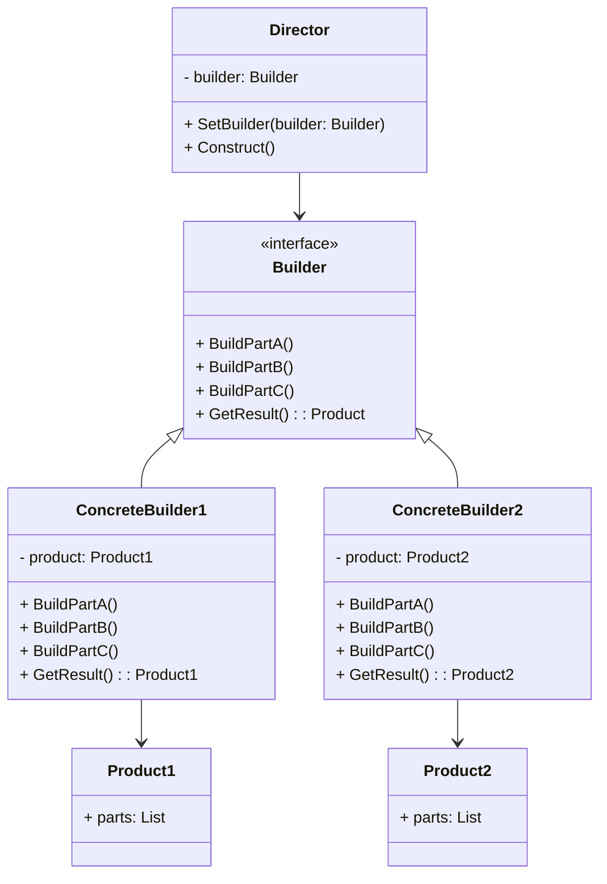

# Builder（建造者模式）

## 意图
将复杂对象的构建与其表示分离，使得同样的构建过程可以创建不同的表示。

## 问题
当创建复杂对象时，如果构造函数参数过多，会导致代码可读性差、难以维护。例如，创建一栋房子需要设置地基、结构、屋顶、装修等多个步骤，这些步骤的组合可能产生多种不同类型的房子。直接使用构造函数会导致"伸缩构造函数"反模式（telescoping constructor），参数列表随着对象复杂度增长而变得难以管理。

## 解决方案
Builder 模式通过将对象构建过程分解为一系列步骤来解决这个问题。它引入一个独立的 Builder 类，负责逐步构建复杂对象。Director 类可以定义构建步骤的顺序，而具体的 Builder 实现则负责每个步骤的具体实现。这样，客户端代码只需要调用 Builder 的方法来配置所需的产品，最后通过 GetResult() 获取构建完成的对象。

## UML 类图

## 适用场景
- 当创建复杂对象的算法应该独立于该对象的组成部分及其装配方式时
- 当构造过程必须允许被构造的对象有不同的表示时
- 当需要构建的对象有多个可选参数，且这些参数有不同的组合方式时

## 优缺点

**优点**：
- 可以分步创建对象，延迟构建步骤，甚至递归调用构建过程
- 将复杂构建代码从业务逻辑中分离出来，提高代码可读性和可维护性
- 支持创建不同表示的产品，复用相同的构建代码

**缺点**：
- 代码复杂度增加，需要创建多个新的类（Builder、Director 等）
- 与直接实例化对象相比，Builder 模式需要更多的代码
- 如果产品内部变化频繁，可能需要频繁修改 Builder 接口

## C++17 实现要点
- **std::optional**: 用于表示可选的构建组件，避免使用哨兵值或空指针
- **std::variant**: 用于表示不同类型的材料或组件，提供类型安全的联合体
- **std::string_view**: 用于高效传递字符串参数，避免不必要的字符串拷贝
- **inline 变量**: 用于定义类内的静态常量，避免头文件重复定义问题
- **结构化绑定**: 用于更清晰地处理 Builder 返回的复杂结果
- **if constexpr**: 用于编译期条件判断，优化不同产品类型的构建逻辑

与传统实现相比，C++17 特性使得 Builder 模式的实现更加类型安全、高效且易于使用。

## 相关模式
- **Abstract Factory**: 与 Builder 类似，都是创建复杂对象。区别在于 Abstract Factory 一次性创建整个产品族，而 Builder 分步构建单个复杂产品。
- **Factory Method**: Builder 模式可以看作是 Factory Method 的扩展，当对象构建过程过于复杂时使用 Builder。
- **Composite**: Builder 构建的产品通常是复杂的树形结构，这时可以与 Composite 模式结合使用。

## 代码示例
指向 src/creational/builder/main.cpp
