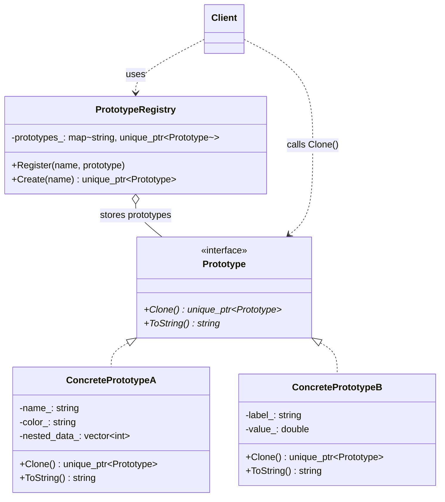

# Prototype（原型模式）

## 意图
通过复制已有对象来创建新对象，而不是通过 new 构造，从而避免昂贵的初始化开销并解耦客户端与具体类。

## 问题
在某些场景下，创建对象的成本非常高——例如需要从数据库加载大量数据、执行复杂的计算初始化、或者需要克隆一棵深层嵌套的对象树。直接在客户端代码中 new 这些对象会导致：
- 初始化逻辑重复且分散在各处
- 客户端依赖于具体的类，违反依赖倒置原则
- 当对象状态复杂（含嵌套对象）时，手动复制容易遗漏字段或产生浅拷贝 bug

## 解决方案
原型模式的核心思想是：让对象自身负责克隆自己。定义一个统一的 `Clone()` 接口，每个具体类实现深拷贝逻辑。客户端只需要持有一个原型对象（或原型注册表），调用 `Clone()` 即可获得一份独立的新副本。新对象拥有与原型相同的结构和状态，但彼此完全独立，修改副本不会影响原型。

## UML 类图

## 适用场景
- 对象初始化成本很高（如从数据库/网络加载数据），用缓存的原型副当代价更小
- 需要在运行时动态创建不同类型的对象，且类型数量不固定
- 需要保存对象的某个历史快照（撤销/恢复功能），通过克隆保留中间状态

## 优缺点

**优点**：
- 克隆操作由对象自身实现，客户端无需了解具体构造细节，降低了耦合
- 可以通过原型注册表在运行时动态扩展新的产品类型，无需修改客户端代码
- 相比每次从零构造，深拷贝已初始化好的原型对象往往更高效

**缺点**：
- 深拷贝实现复杂，当对象包含循环引用或多态嵌套对象时，Clone() 的正确性难以保证
- 每个具体类都需要实现 Clone()，增加了类的职责和维护成本

## C++17 实现要点
- **`std::unique_ptr` 作为返回类型**：Clone() 返回 `std::unique_ptr<Prototype>`，表达所有权转移语义，避免裸指针的内存泄漏风险
- **`std::make_unique`**：在 Clone 实现中安全地构造派生类对象
- **`if constexpr`**：用于类型萃取（type traits）相关的编译期条件判断，根据克隆策略选择不同的拷贝行为
- **`std::optional`**：表示原型注册表中查找可能失败的情况，替代返回空指针或抛异常
- **`inline` 变量**：用于定义注册表中的默认原型名称常量，避免 ODR 问题
- **结构化绑定**：遍历注册表时用 `auto [name, proto]` 直接解构键值对
- **`std::string_view`**：在接口中使用，避免不必要的字符串拷贝
- 与传统实现相比，C++17 的智能指针和类型推导让原型模式的内存管理更安全、代码更简洁

## 相关模式
- **工厂方法（Factory Method）**：工厂方法通过继承来创建对象，原型模式通过克隆来创建。当类的种类很多且需要在运行时动态扩展时，原型模式（配合注册表）比工厂方法更灵活
- **抽象工厂（Abstract Factory）**：抽象工厂可以存储一组原型对象，通过克隆来生产产品，将两种模式结合使用
- **备忘录（Memento）**：备忘录模式保存对象状态用于撤销，原型模式的 Clone() 可以作为保存快照的手段

## 代码示例
参见 [src/creational/prototype/main.cpp](../../src/creational/prototype/main.cpp)
