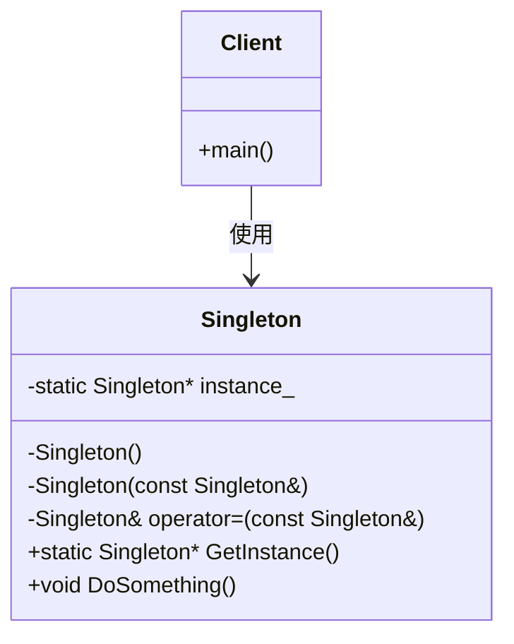

# Singleton（单例模式）

## 意图
保证一个类只有一个实例，并提供一个全局访问点来访问该实例。

## 问题
在某些场景下，我们需要确保某个类在整个系统中只有一个实例存在。例如：
- 配置管理器：系统配置应该统一管理，避免多份配置导致不一致
- 日志记录器：日志输出需要统一管理，避免多个实例竞争写入
- 数据库连接池：连接池应该是全局唯一的，避免资源浪费
- 线程池：线程池应该统一管理，避免创建过多线程

如果允许多个实例存在，可能会导致：
- 资源浪费（重复创建对象）
- 状态不一致（多个实例维护不同状态）
- 竞态条件（多线程环境下）

## 解决方案
单例模式的核心思想是：
1. **私有化构造函数**：防止外部通过 `new` 创建实例
2. **私有化拷贝构造和赋值运算符**：防止通过拷贝创建新实例
3. **提供静态方法**：作为全局访问点，返回唯一实例
4. **静态成员变量**：存储唯一实例

在 C++17 中，我们可以利用线程安全的特性（如 `std::call_once`）来实现更安全的单例模式。

## UML 类图

## 适用场景
- **配置管理**：系统配置应该是全局唯一的，所有模块共享同一份配置
- **日志记录**：日志系统应该是全局唯一的，统一管理日志输出
- **资源管理**：如数据库连接池、线程池等，需要全局统一管理
- **状态管理**：需要在多个模块间共享和同步状态

## 优缺点

**优点**：
- **全局访问点**：提供统一的访问入口，方便使用
- **资源节约**：避免重复创建对象，节省系统资源
- **状态一致性**：所有访问者共享同一实例，保证状态一致
- **延迟初始化**：可以实现懒加载，在第一次使用时才创建实例

**缺点**：
- **违反单一职责原则**：既要管理业务逻辑，又要管理自身实例
- **隐藏依赖关系**：使用单例的类与单例之间存在隐式耦合
- **测试困难**：单例的全局状态会影响单元测试的隔离性
- **并发问题**：在多线程环境下需要特别注意线程安全

## C++17 实现要点
- **`std::call_once` 和 `std::once_flag`**：保证初始化代码只执行一次，线程安全
- **`std::shared_mutex`**：用于读写锁，提高并发读取性能
- **`inline` 变量（C++17）**：允许在头文件中定义静态成员变量
- **`std::optional`（C++17）**：用于表示可能不存在的值，实现懒加载
- **移动语义**：禁用移动构造和移动赋值，防止实例被转移
- **与传统实现对比**：传统双重检查锁定（DCLP）容易出错，C++17 提供了更安全的线程安全初始化方式

## 相关模式
- **工厂模式**：单例可以看作是只创建一个实例的工厂
- **抽象工厂**：抽象工厂的具体实现通常是单例
- **建造者模式**：复杂的单例对象可以使用建造者模式来构建
- **原型模式**：单例模式禁止复制，原型模式专门用于复制

## 代码示例
指向 src/creational/singleton/main.cpp
