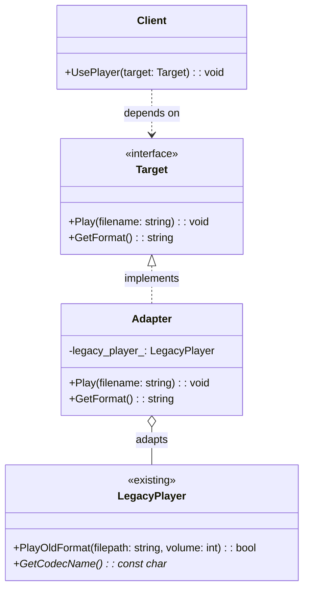

# Adapter（适配器模式）

## 意图
将一个类的接口转换成客户端期望的另一个接口，使得原本接口不兼容的类能够协同工作。

## 问题
在软件开发中，我们经常需要使用已有的类，但其接口与当前系统的接口不匹配。直接修改已有类的源码往往不可行（可能是第三方库、遗留代码，或者修改会影响其他依赖方）。例如，一个老的媒体播放器库只提供了 `PlayOldFormat()` 方法，而新系统期望统一调用 `Play(filename)` 接口。

## 解决方案
适配器模式引入一个中间层——适配器类，它包装（wraps）原有的不兼容类，并对外暴露目标接口。适配器内部将目标接口的调用转发（delegates）给被适配者的方法，完成参数转换和结果适配。客户端只与目标接口交互，完全不知道背后存在适配过程。

## UML 类图

## 适用场景
- 需要使用一个已有的类，但其接口与系统其他部分不兼容时
- 需要统一多个第三方库或遗留组件的接口，让它们能被客户端一致地调用时
- 需要在不修改现有类源码的前提下，将其集成到新系统中时

## 优缺点

**优点**：
- 遵循开闭原则：无需修改现有类，通过新增适配器即可集成，对扩展开放、对修改关闭
- 职责分离：客户端与被适配者解耦，适配逻辑集中在适配器中，便于维护和替换

**缺点**：
- 增加了间接层，调用链变长，可能带来微小的性能开销
- 对于需要适配大量方法的场景，适配器类会变得臃肿

## C++17 实现要点
- **std::variant + std::visit**：用 `std::variant` 存储不同类型的适配器实例，实现类型安全的多态分发，替代传统的继承虚函数表
- **std::optional**：播放结果用 `std::optional<std::string>` 表示，语义清晰地表达"可能失败"的返回值
- **std::string_view**：适配器内部传递文件名时使用 `std::string_view`，避免不必要的字符串拷贝
- **if constexpr**：在模板适配器中根据类型做编译期条件分发
- **inline 变量**：用 `inline constexpr` 定义全局常量，避免 ODR 问题
- **structured bindings**：解构返回的元组，代码更简洁
- **与传统实现的对比**：传统实现依赖纯虚函数 + 指针多态，C++17 版本利用 `std::variant` 在编译期确定所有可能类型，运行时无虚函数开销，且类型安全更强

## 相关模式
- **Bridge（桥接模式）**：两者都涉及接口抽象，但桥接在设计之初就将抽象与实现分离，适配器是事后补救，解决已有的不兼容问题
- **Decorator（装饰器模式）**：装饰器增强已有对象的功能但不改变接口，适配器改变接口但不增强功能
- **Facade（外观模式）**：外观为整个子系统提供统一简化接口，适配器专注于让单个类适配目标接口

## 代码示例
指向 src/structural/adapter/main.cpp
