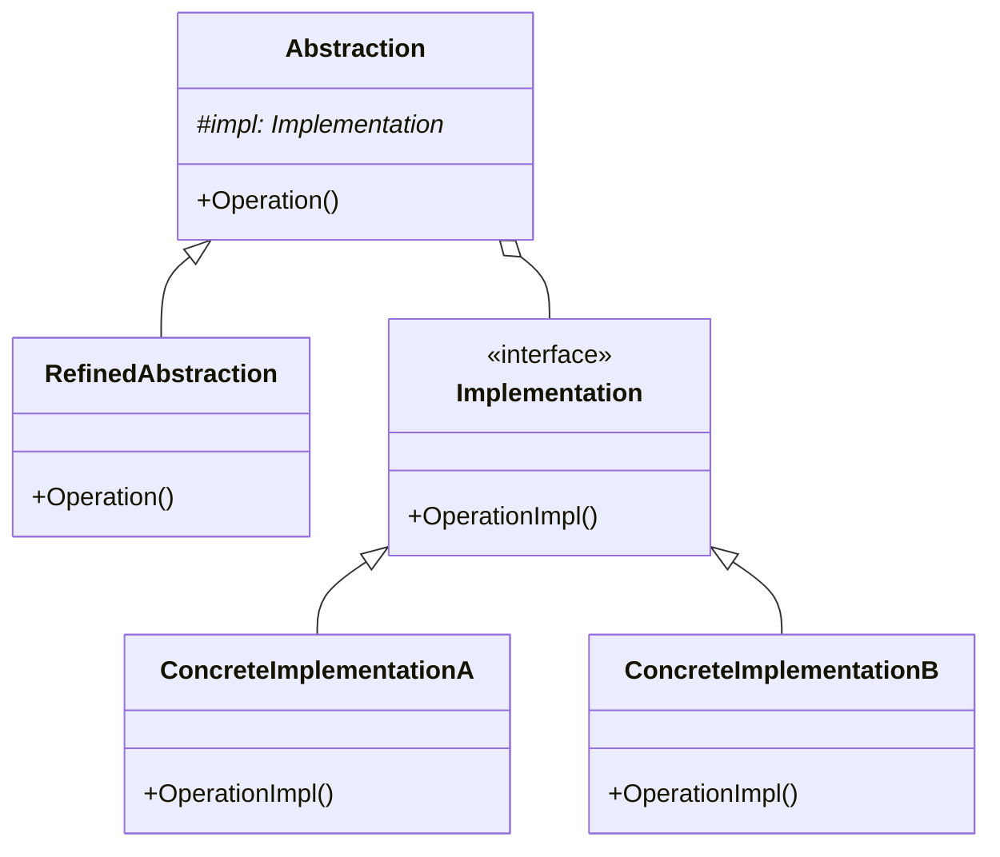

# Bridge（桥接模式）

## 意图
将抽象部分与实现部分分离，使它们都可以独立变化。

## 问题
当一个类存在多个独立变化的维度时，使用继承会导致类的数量呈笛卡尔积增长。例如，一个图形系统需要支持多种形状（圆形、矩形）和多种渲染方式（光栅、矢量），如果用继承来组合，就需要 `RasterCircle`、`VectorCircle`、`RasterRectangle`、`VectorRectangle` 等类。每增加一种形状或渲染方式，类的数量就会倍增，导致代码难以维护。

## 解决方案
桥接模式的核心思想是**用组合代替继承**。将系统拆分为两个独立的层次结构：

- **抽象层（Abstraction）**：定义高层控制逻辑，持有一个指向实现层对象的引用。
- **实现层（Implementation）**：定义底层操作接口，由具体实现类提供不同实现。

抽象层通过委托的方式将工作转发给实现层对象，两个层次可以独立扩展，互不影响。这样就将原来的一个多维度继承树拆分为两个单维度的继承树，通过"桥"（引用/指针）连接。

## UML 类图

## 适用场景
- 当一个类存在两个或多个独立变化的维度，且你不想因为它们的组合而创建大量子类时。
- 当你需要在多个对象间共享一个实现（同时要求客户端不知道这一点）时。
- 当你希望在运行时切换实现，或者实现可以独立于抽象进行扩展时。

## 优缺点

**优点**：
- 分离抽象与实现，两者可以独立扩展，符合开闭原则。
- 避免了继承层次的指数级膨胀，减少了类的数量。
- 提高了可扩展性，新增抽象或实现都无需修改已有代码。

**缺点**：
- 增加了系统的理解和设计难度，需要正确识别出两个独立变化的维度。
- 引入了间接层，可能略微影响性能。

## C++17 实现要点
- 使用 `std::unique_ptr` 管理实现层对象的生命周期，体现现代 C++ 的所有权语义。
- 使用 `std::variant` 配合 `std::visit` 实现编译期多态，作为运行时虚函数的替代方案。
- 使用 `std::string_view` 避免字符串拷贝，提升效率。
- 使用 `inline constexpr` 定义常量，适合头文件中的常量定义。
- 使用结构化绑定（structured bindings）简化代码。
- 与传统实现对比：传统实现通常只使用虚函数和原始指针，而本实现展示了如何利用 C++17 的类型安全联合、智能指针和编译期特性来编写更安全、更高效的代码。

## 相关模式
- **抽象工厂模式（Abstract Factory）**：可以与桥接模式结合使用，由抽象工厂创建并配置正确的实现对象。
- **适配器模式（Adapter）**：适配器模式是在系统已有的类之间建立桥接；而桥接模式是在设计之初就将抽象与实现分离。
- **策略模式（Strategy）**：两者结构相似，都是通过组合将行为委托给另一个对象。区别在于桥接模式强调的是两个层次结构的独立演化，而策略模式强调的是算法的可替换性。

## 代码示例
指向 `src/structural/bridge/main.cpp`
