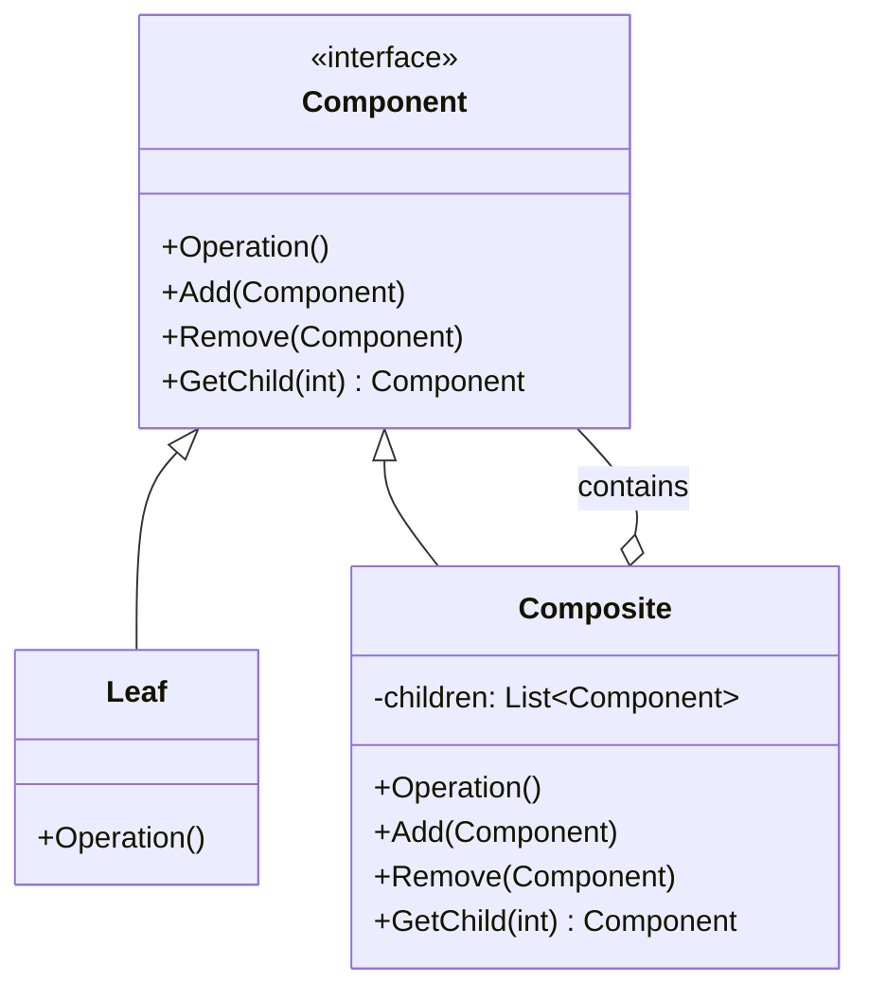

# Composite（组合模式）

## 意图
将对象组合成树形结构以表示"部分-整体"的层次结构，使得客户端对单个对象和组合对象的使用具有一致性。

## 问题
在软件开发中，我们经常需要处理树形结构的数据，例如文件系统（文件和目录）、GUI组件（按钮、面板、窗口）、组织架构（员工、部门）等。这些场景中，叶子节点和容器节点具有相同的接口，但容器节点可以包含其他节点（包括其他容器节点）。

传统实现方式的问题：
1. 客户端代码需要区分叶子节点和容器节点，导致大量条件判断
2. 新增节点类型时需要修改客户端代码
3. 代码重复：相同的逻辑在多个地方出现

## 解决方案
Composite模式的核心思想是：
1. 定义一个统一的组件接口（Component），声明叶子和容器共有的操作
2. 叶子节点（Leaf）实现组件接口，表示树的末端节点
3. 容器节点（Composite）实现组件接口，并包含子组件的集合
4. 容器节点将操作委托给子组件，实现递归处理

通过这种方式，客户端可以统一处理所有节点，无需关心具体类型。

## UML 类图

## 适用场景
- 文件系统：文件和目录的树形结构，统一操作（大小计算、搜索、显示）
- GUI组件：按钮、面板、窗口等组件的嵌套结构
- 组织架构：员工、部门、公司的层次结构
- 命令模式：组合命令和原子命令的统一处理
- 解析器：AST（抽象语法树）的节点组合

## 优缺点

**优点**：
- 客户端代码简化：统一接口，无需区分叶子和容器
- 易于扩展：新增组件类型不影响现有代码
- 符合开闭原则：可以自由组合对象，构建复杂结构
- 灵活性高：可以递归处理任意深度的树结构

**缺点**：
- 设计复杂：需要为叶子和容器定义共同接口，可能过于宽泛
- 类型检查困难：难以限制容器只能包含特定类型的组件
- 性能考虑：深度递归可能导致栈溢出或性能问题

## C++17 实现要点
- **std::variant**：实现类型安全的多态，替代传统的继承体系，避免虚函数开销
- **std::optional**：表示可选的子组件或可失败的操作
- **结构化绑定**：简化对variant的访问，提高代码可读性
- **if constexpr**：编译期条件判断，优化特定类型的处理
- **折叠表达式**：简化可变参数模板的处理
- **std::filesystem**：C++17标准库文件系统支持，用于实际的文件操作

与传统实现对比：
- 传统实现使用虚函数和继承，运行时多态
- C++17实现使用variant和访问者模式，编译期类型安全
- 避免了虚函数表的开销，性能更优
- 类型检查更严格，编译时即可发现类型错误

## 相关模式
- **迭代器模式**：Composite通常与迭代器一起使用，遍历树结构
- **访问者模式**：可以在不修改Composite类的情况下添加新操作
- **装饰器模式**：两者结构类似，但意图不同：装饰器关注功能增强，Composite关注结构组合
- **命令模式**：组合命令是Composite模式的典型应用

## 代码示例
指向 src/structural/composite/main.cpp
