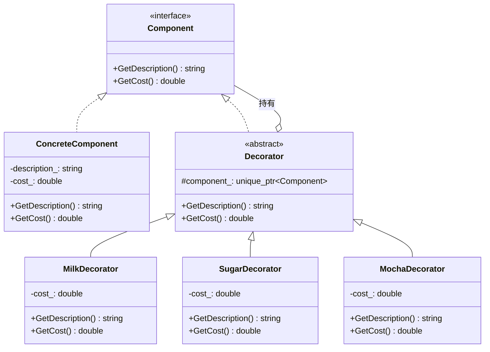

# Decorator（装饰器模式）

## 意图
动态地为对象添加额外职责，相比继承更灵活的扩展对象功能。

## 问题
在软件开发中，我们经常需要为对象添加新功能。传统做法是通过继承来扩展，但这会导致类数量爆炸式增长。例如，一个咖啡店系统有基础咖啡，加上牛奶、糖、摩卡等多种配料，每种组合都创建子类会导致组合爆炸问题。

## 解决方案
装饰器模式通过将对象包装在装饰器对象中来动态添加职责。装饰器与被装饰对象实现相同接口，形成透明的包装链。每个装饰器持有一个指向组件的引用，在调用自身行为前后可以委托给被装饰对象。

## UML 类图

## 适用场景
- 需要动态透明地为对象添加职责，而不影响其他对象
- 需要撤销的功能，装饰器可以在运行时被移除
- 扩展不方便使用子类的情况，如类定义被隐藏或不允许继承

## 优缺点

**优点**：
- 比继承更灵活，可以在运行时动态组合功能
- 遵循开闭原则，无需修改原有代码即可扩展功能
- 可以通过多个装饰器组合实现复杂功能

**缺点**：
- 会产生很多小对象，增加系统复杂度
- 装饰器链过长时调试困难
- 移除特定装饰器比较麻烦

## C++17 实现要点
- 使用 `std::unique_ptr` 管理组件所有权，自动释放资源
- 使用 `std::optional` 表示可能缺失的配置值
- 使用 `std::string_view` 避免字符串拷贝
- 使用结构化绑定简化返回值处理
- 使用 `[[nodiscard]]` 属性确保返回值不被忽略

## 相关模式
- 适配器模式：适配器改变接口，装饰器保持接口不变
- 组合模式：装饰器关注功能增强，组合关注整体-部分层次结构
- 代理模式：代理控制对象访问，装饰器动态添加职责

## 代码示例
指向 src/structural/decorator/main.cpp
