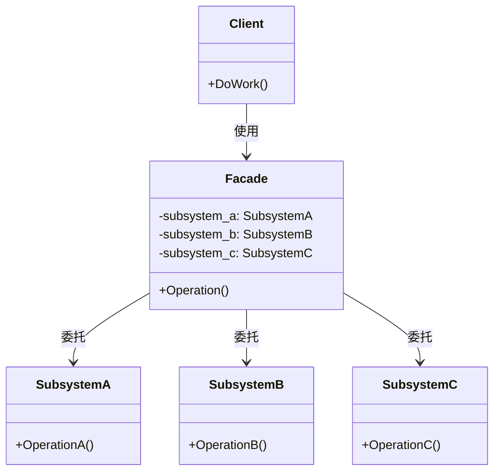

# Facade（外观模式）

## 意图
为子系统中的一组接口提供一个统一的高层接口，使子系统更容易使用。

## 问题
当一个系统由多个复杂的子系统组成时，客户端需要了解每个子系统的接口和交互顺序才能完成一项操作。例如，一个家庭影院系统包含投影仪、功放、DVD 播放器、幕布、灯光等多个子系统，播放一部电影需要按特定顺序调用每个子系统的多个方法。这导致客户端代码与子系统紧密耦合，难以维护和扩展。

## 解决方案
外观模式引入一个外观类（Facade），它封装了子系统的复杂性，为客户端提供简化的高层接口。外观类将客户端的请求委托给适当的子系统对象，同时管理子系统之间的协作顺序。客户端只需要与外观类交互，无需直接了解子系统的内部细节。

## UML 类图

## 适用场景
- 当需要为复杂子系统提供简单接口时，例如为视频转码、文件导入导出等提供一键操作
- 当需要将子系统与客户端解耦时，减少客户端对子系统内部实现的依赖
- 当需要分层构建系统时，使用外观定义每一层的入口，降低层间耦合度

## 优缺点

**优点**：
- 隔离了客户端与子系统的依赖，降低了耦合度
- 简化了复杂系统的使用方式，提升了易用性
- 不影响客户端直接访问子系统（外观不阻止直接访问）

**缺点**：
- 外观类可能变成"上帝类"（God Class），承担过多职责
- 增加了一层间接调用，在极端性能敏感场景下可能有微小开销

## C++17 实现要点
- `std::optional`：用于表示可选子系统（如灯光），避免空指针并表达"可能不存在"的语义
- `std::variant`：用于表示不同的媒体类型（蓝光光盘、DVD、流媒体），实现类型安全的多态替代方案
- `std::string_view`：用于只读字符串常量，避免不必要的 `std::string` 拷贝
- `[[nodiscard]]`：用于查询方法，提醒调用者不要忽略返回值
- `inline` 变量：用于类内常量定义，避免 ODR 问题
- `constexpr` 函数：在编译期计算子系统数量
- 折叠表达式（Fold Expressions）：用于对可变参数模板中的所有子系统批量执行操作
- `std::shared_mutex` / `std::unique_lock`：为外观类提供线程安全的状态管理
- 嵌套命名空间（Nested Namespace）：使用 `namespace a::b::c` 语法简化命名空间声明

## 相关模式
- **Adapter（适配器模式）**：适配器改变已有接口以匹配所需接口；外观提供新的简化接口，不改变已有接口
- **Mediator（中介者模式）**：中介者让各组件互相通信；外观则是单向的，客户端通过外观访问子系统，子系统不知道外观的存在
- **Singleton（单例模式）**：外观类通常适合做成单例，因为系统中只需要一个外观实例
- **Abstract Factory（抽象工厂模式）**：外观可以与抽象工厂结合，为创建子系统对象提供统一入口

## 代码示例
指向 [src/structural/facade/main.cpp](../../src/structural/facade/main.cpp)
