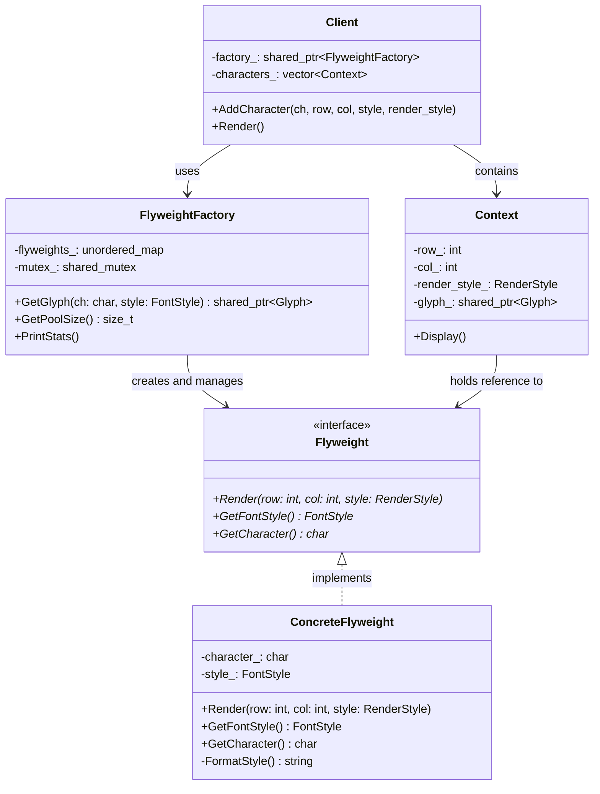

# Flyweight（享元模式）

## 意图
运用共享技术有效地支持大量细粒度对象的复用，以减少内存占用和提高性能。

## 问题
当一个应用程序需要创建大量相似对象时，内存消耗会急剧增加。例如在一个文本编辑器中，每个字符都需要一个对象来表示其字体、大小、颜色等属性。如果文档包含数万个字符，而其中大量字符共享相同的字体样式（如正文全部使用 Arial 12pt），那么为每个字符单独存储完整的样式信息将造成巨大的内存浪费。类似场景也出现在游戏开发中（如大量树木、粒子）、图形渲染系统（如地图瓦片）等需要管理海量细粒度对象的场合。

## 解决方案
享元模式的核心思想是将对象的状态分为两部分：

1. **内在状态（Intrinsic State）**：可以被多个对象共享的、不变的状态，存储在享元对象内部。例如字符的字体、字号。
2. **外在状态（Extrinsic State）**：不能共享的、随环境变化的状态，由客户端在使用时传入。例如字符在文档中的行号和列号。

通过一个享元工厂（Flyweight Factory）来管理享元对象池。当客户端请求一个享元时，工厂先检查池中是否已存在具有相同内在状态的对象：如果存在则直接返回已有实例；如果不存在则创建新实例并放入池中。这样，成千上万个细粒度对象可以共享少量的享元实例，大幅降低内存消耗。

## UML 类图

## 适用场景
- 一个应用程序使用了大量的对象，而由于对象数量庞大造成很大的存储开销
- 对象的大多数状态都可以变为外在状态（即可以外部化、由客户端传入）
- 如果删除对象的外在状态，可以用相对较少的共享对象取代大量对象
- 应用程序不依赖于对象标识，因为共享对象会被多处复用，不能依赖 `==` 或 `===` 来区分

## 优缺点

**优点**：
- 大幅减少内存中对象的数量，降低内存消耗
- 外在状态的计算可能带来少量运行时开销，但远小于内存节省的收益
- 享元对象的复用使得系统更加高效

**缺点**：
- 增加了系统的复杂性，需要分离内在状态和外在状态
- 享元对象的状态变得不可变（intrinsic state），限制了使用灵活性
- 外在状态由客户端维护，增加了客户端的逻辑负担
- 多线程环境下需要额外的同步机制来保护享元池

## C++17 实现要点
- **`std::optional`**：用于表示可选的字体属性，比裸指针或特殊值更安全、更表达意图
- **`std::variant`**：类型安全的联合体，用于表示不同的渲染样式（普通、高亮、下划线、删除线），替代传统的枚举+union 方案
- **结构化绑定（Structured Bindings）**：`auto [key, value] = ...` 语法让遍历哈希表更加简洁直观
- **`if constexpr`**：编译期条件分支，配合 `std::visit` 实现对不同渲染样式的零开销分发
- **`std::shared_mutex`**：读写锁，允许多个线程并发读取享元池，仅在插入新享元时独占写锁，提升并发性能
- **`inline` 变量**：`inline constexpr` 常量可在头文件中定义且保证单一实例，避免 ODR 违规
- **类模板参数推导（CTAD）**：`std::make_pair` 等场景可省略模板参数，代码更简洁

## 相关模式
- **单例模式（Singleton）**：享元工厂通常作为单例或被共享的实例存在，确保全局唯一的对象池
- **组合模式（Composite）**：享元对象可以作为组合模式中的叶子节点共享，例如文档中的字符节点
- **状态模式（State）**：享元模式常与状态模式配合，将可共享的状态对象作为享元管理
- **工厂方法模式（Factory Method）**：享元工厂本质上是一种特殊的工厂，负责创建和缓存享元对象

## 代码示例
见 [src/structural/flyweight/main.cpp](../../src/structural/flyweight/main.cpp)
