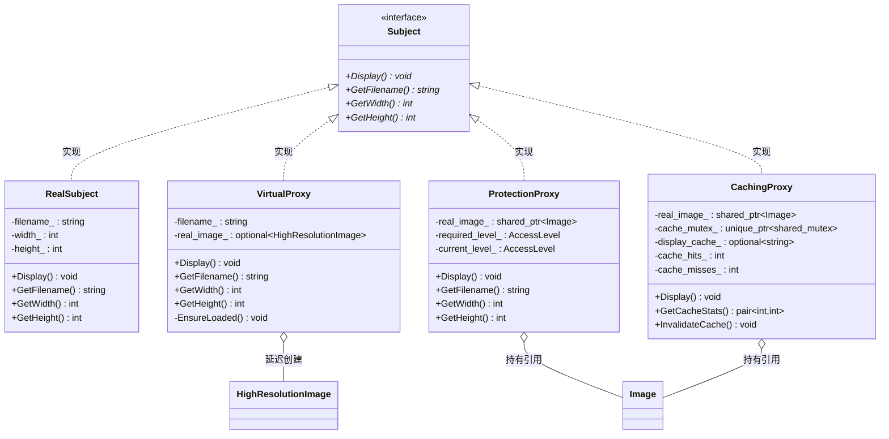

# Proxy（代理模式）

## 意图
为其他对象提供一种代理以控制对这个对象的访问。

## 问题
在软件设计中，某些对象的创建或访问开销很大（如加载高清图片、建立网络连接、执行复杂计算）。如果每次都直接创建和访问这些对象，会导致系统性能低下。此外，有时需要在访问对象时添加额外的控制逻辑，如权限检查、日志记录、缓存等，但又不希望修改原始对象的代码。

## 解决方案
代理模式引入一个代理对象（Proxy），它与真实对象（RealSubject）实现相同的接口（Subject）。代理对象持有真实对象的引用，并在客户端调用时决定是否以及如何将请求转发给真实对象。客户端代码针对接口编程，无需知道它操作的是代理还是真实对象，从而在不改变客户端代码的前提下，透明地添加延迟加载、访问控制、缓存等功能。

## UML 类图

## 适用场景
- **延迟初始化**：对象创建开销大，希望在真正需要时才创建（虚拟代理）
- **访问控制**：需要在访问对象前进行权限校验（保护代理）
- **缓存/结果存储**：需要缓存昂贵操作的结果以避免重复计算（缓存代理）
- **远程代理**：为远程对象提供本地代表，隐藏网络通信细节（远程代理）
- **日志/监控**：需要在不修改原始对象的情况下记录操作日志（日志代理）

## 优缺点

**优点**：
- 遵循开闭原则：可以在不修改真实对象的情况下添加新功能（缓存、权限、日志等）
- 客户端代码与真实对象解耦，代理对客户端透明
- 职责单一：每种代理只关注一个横切关注点，代理可以组合使用

**缺点**：
- 增加了间接层，可能略微增加响应时间
- 代理类数量可能膨胀，每种控制逻辑都需要一个代理类
- 某些代理（如缓存代理）需要额外的内存来存储缓存数据

## C++17 实现要点
- **std::optional**：用于虚拟代理的延迟初始化和缓存代理的缓存值存储，语义清晰地表达"可能有值也可能没有"
- **std::shared_mutex / std::shared_lock / std::unique_lock**：缓存代理使用读写锁实现线程安全的缓存，读操作共享锁、写操作独占锁
- **std::variant + std::visit**：将不同类型的代理统一存储在一个容器中，通过 std::visit 实现编译期多态分发
- **if constexpr**：在模板函数中根据代理类型执行不同的附加逻辑（如缓存代理额外输出统计信息）
- **结构化绑定**：`auto [hits, misses] = proxy.GetCacheStats()` 直接解构 pair 返回值
- **inline 变量**：`ToString()` 函数使用 inline 保证单一定义

与传统 C++ 实现对比：传统实现代理通常只使用虚函数和指针，而 C++17 版本利用值语义（std::optional 延迟构造）、类型安全的联合体（std::variant）、以及现代并发原语（shared_mutex 读写锁），使代码更安全、更表达意图。

## 相关模式
- **Decorator（装饰器模式）**：结构相似，都持有一个对象的引用并实现相同接口。区别在于意图：代理控制对对象的访问，装饰器动态添加职责
- **Adapter（适配器模式）**：适配器改变接口以兼容不兼容的类，代理保持接口不变
- **Facade（外观模式）**：外观提供简化接口，代理提供相同的接口

## 代码示例
指向 [src/structural/proxy/main.cpp](../../src/structural/proxy/main.cpp)
