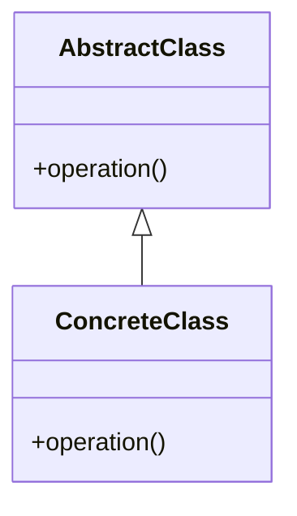
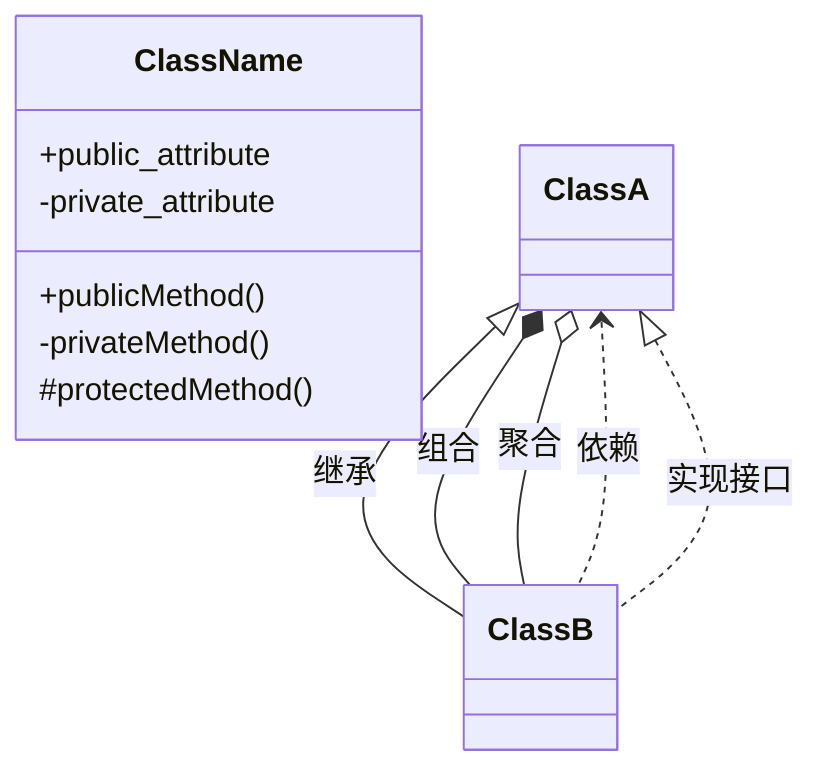

# 设计模式学习项目设计文档

## 概述

基于 C++17 的 23 个 GoF 设计模式学习项目，包含完整的文档说明和可运行的代码示例。

**目标**：
- 系统、深入地学习编程设计模式
- 掌握现代 C++17 特性在设计模式中的应用
- 建立可复用的设计模式知识库

**技术栈**：
- Ubuntu 20.04
- C++17
- CMake 3.14+

---

## 项目结构

```
collection/
├── CMakeLists.txt                    # 顶层构建配置
├── README.md                         # 索引文档 + 学习路径
├── docs/
│   ├── creational/                   # 创建型模式文档
│   │   ├── singleton.md
│   │   ├── factory-method.md
│   │   ├── abstract-factory.md
│   │   ├── builder.md
│   │   └── prototype.md
│   ├── structural/                   # 结构型模式文档
│   │   ├── adapter.md
│   │   ├── bridge.md
│   │   ├── composite.md
│   │   ├── decorator.md
│   │   ├── facade.md
│   │   ├── flyweight.md
│   │   └── proxy.md
│   └── behavioral/                   # 行为型模式文档
│       ├── chain-of-responsibility.md
│       ├── command.md
│       ├── iterator.md
│       ├── mediator.md
│       ├── memento.md
│       ├── observer.md
│       ├── state.md
│       ├── strategy.md
│       ├── template-method.md
│       ├── visitor.md
│       └── interpreter.md
└── src/
    ├── creational/                   # 创建型模式代码
    │   ├── singleton/main.cpp
    │   ├── factory-method/main.cpp
    │   ├── abstract-factory/main.cpp
    │   ├── builder/main.cpp
    │   └── prototype/main.cpp
    ├── structural/                   # 结构型模式代码
    │   ├── adapter/main.cpp
    │   ├── bridge/main.cpp
    │   ├── composite/main.cpp
    │   ├── decorator/main.cpp
    │   ├── facade/main.cpp
    │   ├── flyweight/main.cpp
    │   └── proxy/main.cpp
    └── behavioral/                   # 行为型模式代码
        ├── chain-of-responsibility/main.cpp
        ├── command/main.cpp
        ├── iterator/main.cpp
        ├── mediator/main.cpp
        ├── memento/main.cpp
        ├── observer/main.cpp
        ├── state/main.cpp
        ├── strategy/main.cpp
        ├── template-method/main.cpp
        ├── visitor/main.cpp
        └── interpreter/main.cpp
```

---

## 设计模式完整列表

### 创建型模式 (Creational) - 5 个

| 模式 | 意图 |
|------|------|
| Singleton | 确保一个类只有一个实例，并提供全局访问点 |
| Factory Method | 定义创建对象的接口，让子类决定实例化哪个类 |
| Abstract Factory | 提供创建一系列相关对象的接口，无需指定具体类 |
| Builder | 将复杂对象的构建与其表示分离，允许分步构建 |
| Prototype | 通过复制现有对象来创建新对象 |

### 结构型模式 (Structural) - 7 个

| 模式 | 意图 |
|------|------|
| Adapter | 将一个类的接口转换成客户端期望的另一个接口 |
| Bridge | 将抽象与实现分离，使它们可以独立变化 |
| Composite | 将对象组合成树形结构，统一处理单个对象和组合对象 |
| Decorator | 动态地给对象添加额外职责 |
| Facade | 为子系统提供统一的高层接口 |
| Flyweight | 共享细粒度对象，减少内存使用 |
| Proxy | 为另一个对象提供代理以控制访问 |

### 行为型模式 (Behavioral) - 11 个

| 模式 | 意图 |
|------|------|
| Chain of Responsibility | 将请求沿着处理链传递，直到某个处理者处理它 |
| Command | 将请求封装为对象，支持参数化、队列化和撤销操作 |
| Iterator | 提供顺序访问聚合对象元素的方法，不暴露内部表示 |
| Mediator | 用中介对象封装一组对象的交互，降低耦合 |
| Memento | 在不破坏封装的前提下捕获和恢复对象的内部状态 |
| Observer | 定义一对多依赖，当对象状态改变时通知所有依赖者 |
| State | 允许对象在内部状态改变时改变其行为 |
| Strategy | 定义一系列算法，将每个算法封装起来，使它们可互换 |
| Template Method | 定义算法骨架，将某些步骤延迟到子类 |
| Visitor | 表示作用于对象结构中各元素的操作，不修改元素类 |
| Interpreter | 定义语言的文法，并建立解释器来解释语言中的句子 |

---

## CMake 构建系统设计

### 顶层 CMakeLists.txt

```cmake
cmake_minimum_required(VERSION 3.14)
project(design_patterns LANGUAGES CXX)

set(CMAKE_CXX_STANDARD 17)
set(CMAKE_CXX_STANDARD_REQUIRED ON)
set(CMAKE_CXX_EXTENSIONS OFF)

# 统一编译选项
add_compile_options(-Wall -Wextra -Wpedantic)

# 定义一个函数简化添加模式示例
function(add_pattern_example category name)
    set(target_name "${category}_${name}")
    add_executable(${target_name} src/${category}/${name}/main.cpp)
    set_target_properties(${target_name} PROPERTIES
        OUTPUT_NAME ${name}
        RUNTIME_OUTPUT_DIRECTORY ${CMAKE_BINARY_DIR}/bin/${category}
    )
endfunction()

# 创建型模式
add_pattern_example(creational singleton)
add_pattern_example(creational factory-method)
add_pattern_example(creational abstract-factory)
add_pattern_example(creational builder)
add_pattern_example(creational prototype)

# 结构型模式
add_pattern_example(structural adapter)
add_pattern_example(structural bridge)
add_pattern_example(structural composite)
add_pattern_example(structural decorator)
add_pattern_example(structural facade)
add_pattern_example(structural flyweight)
add_pattern_example(structural proxy)

# 行为型模式
add_pattern_example(behavioral chain-of-responsibility)
add_pattern_example(behavioral command)
add_pattern_example(behavioral iterator)
add_pattern_example(behavioral mediator)
add_pattern_example(behavioral memento)
add_pattern_example(behavioral observer)
add_pattern_example(behavioral state)
add_pattern_example(behavioral strategy)
add_pattern_example(behavioral template-method)
add_pattern_example(behavioral visitor)
add_pattern_example(behavioral interpreter)
```

### 构建产物组织

```
build/
└── bin/
    ├── creational/
    │   ├── singleton
    │   ├── factory-method
    │   └── ...
    ├── structural/
    │   └── ...
    └── behavioral/
        └── ...
```

### 构建命令

```bash
mkdir build && cd build
cmake ..
cmake --build .
# 运行单个示例
./bin/creational/singleton
```

---

## 文档模板

每个模式的 `.md` 文档采用统一模板：

```markdown
# 模式名称（中文名）

## 意图
一句话描述模式的核心目的。

## 问题
描述该模式要解决的具体问题场景。

## 解决方案
用文字描述模式的核心思想。

## UML 类图



## 适用场景
- 场景 1
- 场景 2
- 场景 3

## 优缺点

**优点**：
- 优点 1
- 优点 2

**缺点**：
- 缺点 1
- 缺点 2

## C++17 实现要点
- 使用了哪些 C++17 特性
- 为什么用这些特性
- 与传统实现的对比

## 相关模式
- 与哪些模式有关联
- 区别是什么

## 代码示例
指向 `src/` 下对应的代码目录。
```

---

## 代码示例模板

每个模式的 `main.cpp` 遵循统一结构：

```cpp
/**
 * 设计模式名称
 *
 * 意图：一句话描述
 *
 * C++17 特性：
 * - std::optional / std::variant / std::any
 * - structured bindings / if constexpr / fold expressions
 * - etc.
 */

#include <iostream>
#include <string>
#include <memory>
// 其他需要的头文件

// ============================================
// 模式核心实现
// ============================================

// 类定义、接口、具体实现...

// ============================================
// 使用示例
// ============================================

int main() {
    std::cout << "=== 模式名称 ===" << std::endl;

    // 演示模式的使用
    // 展示关键特性

    return 0;
}
```

### 代码风格规范（Google C++ Style）

- **类名**：`PascalCase`（如 `Singleton`, `Observer`）
- **函数名**：`PascalCase`（如 `GetInstance`, `Attach`）
- **变量名**：`snake_case`（如 `instance_`, `observers_`）
- **常量**：`kConstantName`（如 `kMaxSize`）
- **成员变量**：`snake_case_` 加下划线后缀
- **缩进**：2 空格
- **花括号**：换行（函数、类、控制结构）
- **注释**：`//` 单行，`/* */` 多行

---

## 索引文档 README.md

顶层 `README.md` 作为总入口：

```markdown
# 设计模式学习笔记

基于 C++17 的 23 个 GoF 设计模式实现与学习笔记。

## 环境要求

- Ubuntu 20.04
- C++17
- CMake 3.14+

## 构建与运行

​```bash
mkdir build && cd build
cmake ..
cmake --build .
# 运行示例
./bin/creational/singleton
​```

## 设计模式索引

### 创建型模式 (Creational)

| 模式 | 文档 | 代码 | 说明 |
|------|------|------|------|
| Singleton | [文档](docs/creational/singleton.md) | [代码](src/creational/singleton/) | 确保一个类只有一个实例 |
| Factory Method | [文档](docs/creational/factory-method.md) | [代码](src/creational/factory-method/) | 定义创建对象的接口 |
| ... | ... | ... | ... |

### 结构型模式 (Structural)
（同上格式）

### 行为型模式 (Behavioral)
（同上格式）

## 学习路径建议

1. **入门**：Singleton → Factory Method → Observer → Strategy
2. **进阶**：Abstract Factory → Decorator → Command → State
3. **高级**：Builder → Composite → Visitor → Interpreter
```

---

## UML 类图规范

使用 Mermaid 语法，嵌入 Markdown 文档，GitHub 自动渲染。

**基本语法**：



**命名规范**：
- 类名使用 PascalCase
- 方法名使用 PascalCase
- 属性名使用 snake_case
- 使用中文注释说明关系

---

## 实施计划

### 阶段 1：项目骨架
- 创建目录结构
- 编写 CMakeLists.txt
- 编写 README.md 索引文档

### 阶段 2：创建型模式（5 个）
- Singleton
- Factory Method
- Abstract Factory
- Builder
- Prototype

### 阶段 3：结构型模式（7 个）
- Adapter
- Bridge
- Composite
- Decorator
- Facade
- Flyweight
- Proxy

### 阶段 4：行为型模式（11 个）
- Chain of Responsibility
- Command
- Iterator
- Mediator
- Memento
- Observer
- State
- Strategy
- Template Method
- Visitor
- Interpreter

### 阶段 5：完善与优化
- 文档审校
- 代码优化
- 学习路径补充

---

## 验收标准

1. **文档完整性**：23 个模式各有独立文档，包含意图、UML、场景、优缺点、C++17 要点
2. **代码可运行**：所有示例可编译运行，输出符合预期
3. **风格统一**：遵循 Google C++ 编码规范
4. **构建系统**：统一 CMake 项目，一键构建所有示例
5. **索引导航**：README.md 提供完整索引和学习路径
